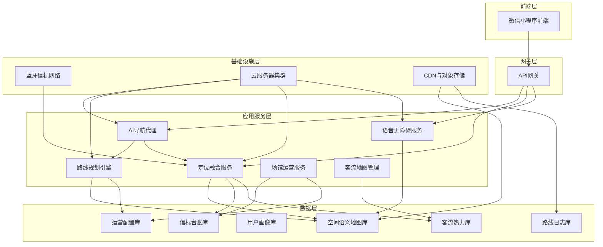
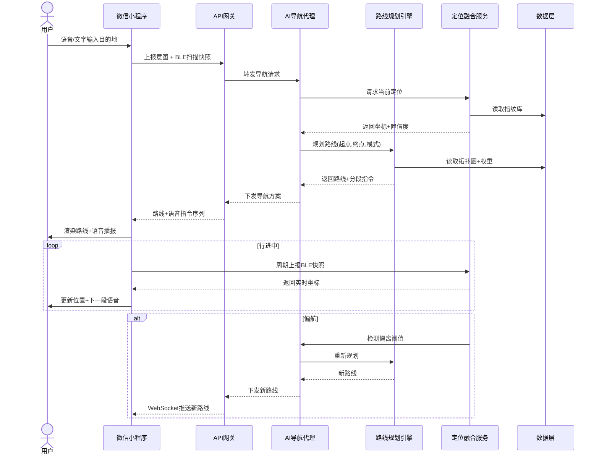

# PathAI 室内导航系统 · 系统架构设计

> **方案采用"微信小程序原生BLE + 云端AI导航代理"的分层架构，自下而上分为基础设施、数据、应用服务、网关、前端五层，视障能力通过小程序自驱动的语音+震动通道实现，不依赖系统读屏。**

## 一、系统架构总览

### AI Native 架构理念

系统可以分为五层：


### 五层分层架构



## 二、各层核心职责

### 第一层：基础设施层

这是整个系统的物理与云资源底座，决定了定位精度、服务可用性和数据存储能力。

**蓝牙信标网络**是室内定位的信号源。信标采用 BLE 5.0 协议，以 iBeacon / Eddystone 帧格式广播广告包，广播间隔建议设为 100~300 毫秒，发射功率根据覆盖范围调整在 -12~+4 dBm 之间。每个信标拥有全局唯一的 UUID、Major、Minor 编码，并对应一个空间坐标、楼层、安装高度和覆盖语义。信标电池续航是运维关键，建议选用锂电池款型，续航 3~5 年，并接入电池电量上报机制。信标按决策节点原则布点，重点覆盖建筑出入口、楼梯扶梯两端、电梯厅、走廊转角、重要房间门口和服务台。

**云服务器集群**承载全部应用服务。建议采用容器化部署，以 Kubernetes 编排，按服务域划分命名空间，例如 `pathai-routing`、`pathai-location`、`pathai-agent`、`pathai-ops`。计算型服务与 AI 推理服务分离部署，AI 导航代理可使用 GPU 节点加速语义理解。

**CDN 与对象存储**负责存放室内地图瓦片、信标指纹库、语音提示音频包、场馆图片素材和小程序静态资源。地图瓦片按楼层和缩放层级切片，通过 CDN 边缘缓存加速小程序端加载。

### 第二层：数据层

数据层管理六类核心数据，对应六类存储策略。

**空间语义地图库**存储的不是普通栅格地图，而是"可被 AI 理解的结构化空间"。它包含几何图层（墙体、房间轮廓、走廊中线）、语义图层（房间用途、门类型、通道属性）、拓扑图层（节点与可通行边）和无障碍图层（坡道、盲道、电梯、扶手、障碍物）。每张地图有版本号、楼层归属、场馆归属和生效时间，支持灰度发布和回滚。

**信标台账库**记录每个信标的物理属性与运行状态，包括信标 ID、坐标、楼层、安装位置描述、发射功率、广播间隔、电池电量、最后心跳时间、离线告警状态和覆盖区域标签。

**用户画像库**在隐私合规前提下存储用户的导航偏好，例如是否启用视障模式、偏好无障碍路线、偏好少转弯、是否需要语音播报、常用目的地等。画像以偏好向量形式存储，不绑定真实身份，可通过匿名 ID 关联。

**路线日志库**记录每一次导航任务的完整链路，包括起点、终点、规划路线、实际行走轨迹、用时、是否完成、在何处偏航、是否触发重新规划、视障语音指令序列和用户反馈评分。这是 AI 代理自我优化的训练数据来源。

**客流热力库**按时间维度和空间网格记录人流密度，用于动态路线规划中的拥堵成本计算，并向运营后台输出热力图。

**运营配置库**存储场馆管理员维护的施工封闭区域、临时绕行、活动占位、营业时间变更、出入口开关状态和紧急公告。

### 第三层：应用服务层

这一层是系统的能力中枢，包含六个核心服务。

**AI 导航代理**是系统的"大脑"。它接收用户自然语言输入，执行意图识别、槽位提取、上下文补全和任务编排，再调用路线规划引擎和定位服务，最后将结果转化为用户可理解的导航指令。代理应具备多轮对话能力，能够处理"改去最近的无障碍卫生间""还是去三楼那个吧""刚才那个路线再走一遍"这类上下文关联请求。代理内部维护一个会话状态机，记录当前目的地、当前路线、当前偏好和当前用户模式。

**路线规划引擎**基于加权有向图执行多目标寻路。图节点对应地图拓扑节点，图边对应可通行路段，边权重由距离、时间、无障碍惩罚、拥堵成本和风险成本加权求和构成：

$$
W(e) = w_d \cdot d(e) + w_t \cdot t(e) + w_a \cdot a(e) + w_c \cdot c(e) + w_r \cdot r(e)
$$

不同用户模式对应不同权重向量 $[w_d, w_t, w_a, w_c, w_r]$。例如视障模式大幅提高 $w_a$ 与 $w_r$，普通模式更看重 $w_d$ 与 $w_t$。寻路算法采用 A* 加分层预处理，对跨楼层路径先做楼层图粗规划，再在每层做室内精细规划，避免单层图过大导致搜索爆炸。

**定位融合服务**接收小程序上报的 BLE 扫描结果，结合指纹库匹配和惯性航位推算，输出用户当前坐标与置信度。核心算法是"指纹匹配 + 卡尔曼滤波 + 地图匹配"三级流水线。指纹匹配将当前 RSSI 向量与预采指纹库做最近邻检索，得到粗定位；卡尔曼滤波融合手机陀螺仪与加速度计的航位推算，平滑短时抖动；地图匹配将定位点吸附到最近的可行走路段上，纠正穿墙漂移。

**语音无障碍服务**专门为视障模式服务，负责把结构化导航指令转化为分段语音播报和触觉反馈序列。它维护一个指令模板库和优先级队列，确保高优先级安全提示（如"前方楼梯"）能够打断当前播报。

**场馆运营服务**为后台管理系统提供能力，包括地图版本管理、信标监控、施工区域配置、客流查询、协助请求处理和用户反馈分析。

**客流地图管理**汇聚定位服务输出的匿名位置流，按空间网格和时间窗口聚合为热力数据，供路线规划和运营展示共用。

### 第四层：API 网关层

网关统一处理来自小程序的请求，承担鉴权、限流、路由、协议转换和访问日志职责。鉴权基于微信登录态换发的 JWT 令牌，限流按用户维度和服务维度分别设阈值，防止异常流量击穿下游服务。网关还应支持 WebSocket 长连接，用于导航过程中服务端推送指令和重新规划通知。

### 第五层：微信小程序前端

前端是用户直接接触的部分，在微信小程序框架内实现四大能力模块。

**地图渲染模块**使用小程序原生 `map` 组件或自研 Canvas 渲染层，叠加室内地图底图、路线折线、用户位置标记、信标标记和目的地标记。考虑到室内地图非标准瓦片，建议自研基于 Canvas 的楼层平面图渲染，支持缩放、平移、楼层切换和路线高亮。

**语音震动模块**调用小程序 `wx.vibrateShort`、`wx.vibrateLong` 实现震动反馈，通过 `wx.createInnerAudioContext`（本地预录音频）和 `wx.getBackgroundAudioManager`（后台播报保活）实现语音播放。视障模式下语音指令通过 TTS 合成，震动按短震、长震、连续短震编码不同语义。

**BLE 扫描模块**使用小程序 `wx.openBluetoothAdapter`、`wx.startBluetoothDevicesDiscovery`、`wx.onBluetoothDeviceFound` 持续扫描周围信标，采集 RSSI 与设备 ID，按固定周期上报定位服务。扫描需处理权限申请、后台扫描限制和 iOS/Android 差异。

**无障碍 UI 模块**提供高对比度、大字号、单按钮交互界面，支持语音唤醒、长按确认、快捷指令面板和一键协助。它不依赖系统读屏，由小程序自驱动语音与震动通道，保证视障用户在未开启读屏软件时也能独立使用。

## 三、核心数据流

系统存在三条贯穿始终的数据流，理解它们就能理解系统如何运转。

### 定位数据流

蓝牙信标持续广播 BLE 广告帧，小程序端 BLE 扫描模块以约 1 秒周期采集可见信标的 RSSI 与 ID，封装为扫描快照上报定位融合服务。定位服务在指纹库中做最近邻匹配得到粗坐标，再用卡尔曼滤波融合手机惯性数据，最后做地图匹配吸附到可行走路段，输出 $(x, y, floor, confidence)$ 四元组回传小程序，同时写入客流热力库。

### 导航数据流

用户输入自然语言或选择目的地，AI 导航代理解析意图，调用路线规划引擎。规划引擎从空间语义地图库读取拓扑图，按用户模式取权重向量，执行分层 A* 寻路，返回路线折线、分段指令序列和预计用时。代理将结果下发小程序，小程序地图渲染模块绘制路线，语音无障碍服务按段生成播报计划。

### 反馈数据流

导航过程中小程序持续上报实际位置，若偏离路线超阈值则触发重新规划。导航结束后路线日志库记录完整链路，AI 代理据此优化意图理解和指令模板，运营后台据此分析迷路热点和信标盲区。

### 端到端调用链



## 四、关键接口设计

网关对外暴露的核心接口按导航生命周期组织，采用 REST 风格，长连接指令通过 WebSocket 推送。

### 定位上报接口

```
POST /api/v1/locate
```

小程序周期提交扫描快照，包含设备列表 `[{beaconId, rssi, mac}]`、惯性数据 `[{gyro, accel, ts}]` 和当前楼层猜测。服务端返回坐标四元组与置信度。

### 路线规划接口

```
POST /api/v1/nav/plan
```

请求体包含起点坐标、目的地标识或自然语言、用户模式、偏好列表和当前时间。响应体返回路线折线 `polyline`、分段指令数组 `segments`、预计用时和备选路线。

### 导航会话长连接

```
WS /api/v1/nav/session/{sessionId}
```

服务端在会话期间推送实时坐标更新、下一段指令、重新规划通知、安全提示和协助确认。小程序通过该连接维持导航态。

### 用户反馈接口

```
POST /api/v1/feedback
```

用于导航结束后提交评分、迷路点和问题类型，供 AI 代理优化。

### 协助请求接口

```
POST /api/v1/assist
```

视障用户长按触发后，服务台收到带定位的协助工单。

## 五、微信小程序技术要点

### BLE 扫描

`wx.startBluetoothDevicesDiscovery` 需先调用 `wx.openBluetoothAdapter` 初始化，且要求用户授权位置权限（Android）和蓝牙权限。扫描回调 `wx.onBluetoothDeviceFound` 返回设备 name、deviceId、RSSI 和 advertisData。需按信标的 UUID 过滤，剔除无关蓝牙设备。iOS 与 Android 的 RSSI 量化和后台扫描行为不同，iOS 后台扫描会被系统限制频率，需在导航态保持前台或使用小程序后台播放音频保活。

### 性能优化

BLE 扫描回调高频触发，应在采集层做节流，按 1 秒窗口聚合并去抖后再上报，减少网络请求。地图 Canvas 渲染需控制重绘范围，仅更新用户位置标记和路线进度，避免整图重绘导致掉帧。

### 长连接管理

小程序 `wx.connectSocket` 支持 WebSocket，但小程序切后台后连接可能被回收，需在 `onHide` 时保存导航态到本地缓存，`onShow` 时恢复并重建连接。服务端会话应设计为无状态可恢复，凭 sessionId 续接。

### 无障碍适配

小程序原生组件对读屏支持有限，因此本系统选择自驱动语音与震动通道，不完全依赖 TalkBack/VoiceOver。但仍应给关键元素设置 `aria-label`，兼容开启读屏的用户。TTS 可使用微信同传插件或自建云端 TTS 服务，视障关键节点的预录音频通过 `wx.createInnerAudioContext` 播放，延迟更低。

## 六、技术选型汇总表

| 层级 | 核心模块 | 关键职责 | 技术选型建议 |
|------|---------|---------|------------|
| 基础设施 | 蓝牙信标网络 | 广播 BLE 广告帧 | BLE 5.0 信标，iBeacon/Eddystone 帧 |
| 基础设施 | 云服务器集群 | 承载应用服务 | Kubernetes 容器化，GPU 节点供 AI |
| 基础设施 | CDN/对象存储 | 地图瓦片与素材 | 对象存储 + CDN 边缘缓存 |
| 数据 | 空间语义地图库 | 几何+语义+拓扑+无障碍 | 空间数据库 + 版本管理 |
| 数据 | 信标台账库 | 信标属性与状态 | 关系型数据库 |
| 数据 | 用户画像库 | 导航偏好向量 | 键值存储，匿名 ID 关联 |
| 数据 | 路线日志库 | 导航全链路日志 | 时序数据库 |
| 数据 | 客流热力库 | 时空人流密度 | 列式存储 + 网格索引 |
| 数据 | 运营配置库 | 施工/活动/开关状态 | 关系型数据库 |
| 应用 | AI 导航代理 | 意图理解与任务编排 | 大语言模型 + 会话状态机 |
| 应用 | 路线规划引擎 | 多目标加权寻路 | A* + 分层预处理 |
| 应用 | 定位融合服务 | 坐标与置信度计算 | 指纹匹配 + 卡尔曼滤波 + 地图匹配 |
| 应用 | 语音无障碍服务 | 指令转语音与震动 | TTS + 优先级队列 |
| 应用 | 场馆运营服务 | 后台管理能力 | REST 服务 |
| 应用 | 客流地图管理 | 热力聚合 | 流式计算 |
| 网关 | API 网关 | 鉴权限流路由 | 网关 + JWT + WebSocket |
| 前端 | 地图渲染 | 室内平面图渲染 | 小程序 Canvas 自研层 |
| 前端 | 语音震动 | TTS 与触觉反馈 | 小程序蓝牙与震动 API |
| 前端 | BLE 扫描 | 信标采集与上报 | 小程序蓝牙适配器 API |
| 前端 | 无障碍 UI | 自驱动无障碍交互 | 高对比度组件库 |
