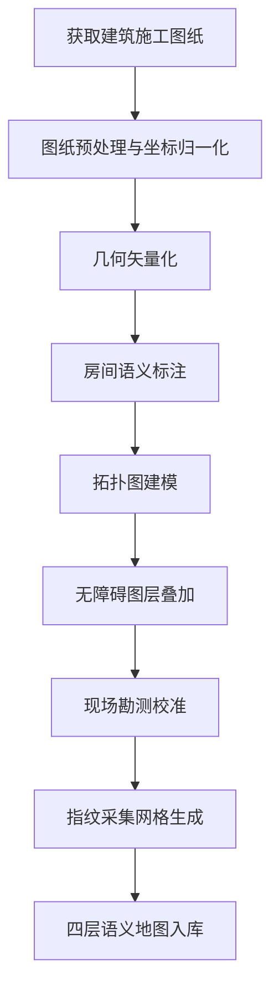

# PathAI 室内导航系统 · 地图构建指南

> **用建筑施工图纸构建测试地图的核心流程是：图纸解析→坐标归一化→几何矢量化→语义标注→拓扑建模→无障碍图层叠加，最终输出系统可消费的四层语义地图。**

## 一、地图构建工作流



## 二、获取并理解建筑施工图纸

### 2.1 需要获取的图纸类型

学校教学楼项目通常有以下几套图纸，每套对地图构建的价值不同。

**建筑平面图**是核心底图来源。它提供每层的墙体轮廓、房间分隔、门窗位置、楼梯电梯位置、走廊走向和房间标注。你需要拿到 1 层和 2 层的建筑平面图，建议找设计阶段的 CAD 版本而非 PDF，矢量数据可以直接转化。

**无障碍设计专篇**如果教学楼是近年新建或改造项目，图纸上会标注无障碍电梯、无障碍卫生间、坡道和盲道。这是无障碍图层的主要来源。

**消防疏散图**标注疏散方向、安全出口和防火分区，对拓扑图建模和风险节点标注非常有价值。

**室内设计施工图**如果存在，会提供更细的地面材质分区、扶手位置和门开启方向，有助于提升语义精度。

**电气与弱电图纸**可以辅助确定信标供电点位和已有弱电管井，降低部署难度，但对地图本身影响不大。

实操建议是去学校基建处或后勤管理处调取图纸，优先要 DWG 或 DXF 格式的 CAD 文件；如果只有 PDF 蓝图，可以用矢量化工具转，但精度会有损失。

### 2.2 图纸预处理与坐标归一化

拿到 CAD 图纸后不能直接用，需要做三步预处理。

**第一步是统一坐标系。** CAD 图纸的坐标是工程坐标系，原点可能在项目基点，数值范围很大。在地图编辑器中新建项目时，以 1 层主入口为局部原点 $(0,0)$，单位统一用米。把 1 层和 2 层分别导入，旋转对齐使主走廊方向与 X 轴平行，便于后续算法计算。

**第二步是比例尺校正。** CAD 导出的 SVG 或 GeoJSON 可能尺寸不对，需要用图纸标注的一处实际尺寸做标尺校准。例如图纸上标注一间教室开间 9 米，在编辑器中量取对应线段长度，用比值缩放全图。

**第三步是图层清理。** CAD 图纸有大量与地图无关的图层（尺寸标注、家具布置、文字注释、轴线），只保留墙体、门窗、楼梯、电梯、卫生间隔断和走廊中线，其余隐藏或删除，减少矢量化后的数据噪声。

## 三、几何矢量化

几何矢量化是把 CAD 中的墙体和房间轮廓转化为系统可用的几何图层。核心产出是一组带坐标的线段和多边形，描述墙体走向、房间边界和门窗洞口。

### 3.1 从 CAD 导出几何数据

如果拿到的是 DWG/DXF 格式，最直接的方式是用 QGIS 或 AutoCAD 将墙体图层导出为 GeoJSON。操作步骤是在 QGIS 中打开 DXF，勾选"墙体"和"门窗"图层，导出时使用自定义局部平面坐标系（以 1 层主入口为原点、单位为米），不要使用 EPSG:4326 等经纬度坐标系——室内局部地图用经纬度会引入投影变形和精度损失，且与后续所有"米制距离"计算不一致。

导出后的每条墙体是一条 LineString，每个房间是一个 Polygon。需要注意 CAD 中墙体是双线表示（墙厚两侧各一条线），矢量化时可以保留双线，也可以取墙中线合并为单线，取决于地图渲染方式。对视障导航而言，墙中线更适合做地图匹配和碰撞检测。

如果拿到的是 PDF 蓝图，可以用 AutoCAD 的 PDF Underlay 功能描图，或用在线工具如 pdf2svg 先转 SVG 再在编辑器中手动描点。手动描图精度低，但学校教学楼结构规整，误差可控制在 0.2 米以内，对测试环境可接受。

### 3.2 门窗与洞口标注

门窗是拓扑建模的关键，必须单独标注为"可通行洞口"而非普通墙体。在矢量化时，每扇门标注为一个带属性的点或短线段，属性包括门类型（平开/推拉/自动/玻璃）、开向（内开/外开/左开/右开）、门宽、是否有门槛。

从图纸上可以直接读到的信息：建筑平面图的门窗图例会标出门宽和类型，门宽标注如"M1-1000"表示 1000 毫米宽的 1 型门。把这些标注录入为门的属性，后续拓扑建模时用门宽判断是否轮椅可通行（一般 800 毫米以上为可通行）。

### 3.3 几何数据结构

矢量化后每个几何对象的结构如下，这是入库时的标准格式：

```json
{
  "geometryType": "wall",
  "floor": 1,
  "coordinates": [[0.0, 0.0], [30.0, 0.0]],
  "thickness": 0.24,
  "material": "brick"
}
```

房间（Polygon）记录闭合轮廓，门（Point）记录门洞中心坐标和属性。所有坐标以一层主入口为原点的局部米制坐标系存储，楼层用 `floor` 字段区分。

## 四、房间语义标注

几何图层只告诉系统"这里有一面墙、那里有一个房间轮廓"，但不知道这个房间是教室还是卫生间。语义标注就是为每个几何对象挂载可理解的属性。

### 4.1 从图纸标注提取语义

建筑平面图上每个房间都有标注，例如"101 教室""男卫生间""配电间""走廊"。把这些标注逐个录入对应房间的 Polygon 属性中。

学校教学楼的房间类型相对有限，常见的有：普通教室、阶梯教室、实验室、教研室、办公室、卫生间、楼梯间、电梯间、走廊、大厅、设备间。建议建一个房间类型枚举表，每个房间标注时选择对应类型，而不是直接录入文字，方便后续路线规划和语音指令统一引用。

### 4.2 语义属性字段

每个房间除了类型，还需标注以下属性：

- 房间编号（如 101、102），用于导航目的地的模糊匹配
- 是否公共空间（卫生间、楼梯间、电梯间为公共，教室为非公共）
- 是否有独立出入口（决定拓扑建模时是否需要从走廊接入）
- 楼层归属
- 是否无障碍可达（结合无障碍图纸判断）

以教学楼一层为例，标注后的房间语义如下：

| 房间编号 | 类型 | 坐标范围（米） | 公共 | 无障碍可达 |
|---------|------|--------------|------|-----------|
| 101 | 普通教室 | (8.5, 0.5)-(15.5, 7.0) | 否 | 是 |
| 102 | 普通教室 | (16.5, 0.5)-(23.5, 7.0) | 否 | 是 |
| 楼梯A | 楼梯间 | (0.5, 0.5)-(7.5, 7.0) | 是 | 否（视障禁用） |
| 无障碍电梯 | 电梯间 | (0.5, 7.5)-(7.5, 12.0) | 是 | 是 |
| 阶梯教室 | 阶梯教室 | (12.5, 14.5)-(22.5, 29.0) | 否 | 是 |
| 卫生间 | 卫生间 | (32.5, 14.5)-(42.5, 29.0) | 是 | 需核实 |

"需核实"的字段就是图纸上看不出来、必须现场勘测确认的。这正是下一步无障碍图层叠加和现场校准要做的事。

## 五、拓扑图建模

拓扑图是路线规划引擎直接消费的数据结构。它把连续的室内空间抽象为离散的节点和边，节点对应决策点，边对应可通行路段。

### 5.1 节点提取

拓扑节点不是随意选取的，而是从几何和语义图层推导出来的。节点类型分三类。

**走廊交叉口节点**：两条走廊交汇处。教学楼一层走廊是东西向单走廊，交叉口出现在走廊与南北向通道的交汇点。

**门口节点**：每个可通行门洞的中心点是一个节点，表示从走廊进入房间的转换点。101 教室门口、102 教室门口各一个节点。

**设施接入节点**：楼梯口、电梯口、卫生间入口、建筑出入口。这些节点是跨楼层和跨建筑的关键枢纽。

一层示例拓扑节点：

| 节点ID | 类型 | 坐标（米） | 语义 |
|--------|------|-----------|------|
| N1-01 | 建筑出入口 | (4.0, 24.0) | 主入口 |
| N1-02 | 交叉口 | (12.0, 22.0) | 走廊-阶梯教室通道口 |
| N1-03 | 交叉口 | (26.0, 22.0) | 走廊中段交叉口 |
| N1-04 | 交叉口 | (36.0, 22.0) | 走廊-卫生间通道口 |
| N1-05 | 门口 | (12.0, 13.0) | 阶梯教室入口 |
| N1-06 | 门口 | (26.0, 9.0) | 教研室入口 |
| N1-07 | 门口 | (36.0, 9.0) | 卫生间入口 |
| N1-08 | 设施接入 | (44.0, 22.0) | 侧入口/坡道口 |
| N1-09 | 门口 | (12.0, 7.0) | 101 教室门口 |
| N1-10 | 门口 | (20.0, 7.0) | 102 教室门口 |

### 5.2 边构建与属性赋值

两个节点之间如果存在可通行路径，就建一条边。每条边从图纸和语义数据中自动推导出以下属性：

- **距离 $d$**：从两个节点坐标的欧氏距离计算
- **预估用时 $t$**：$t = d / v$，视障用户步速 $v$ 取 0.8 米/秒
- **无障碍等级 $a$**：根据边的路况判断，纯走廊平直路段 $a=0$，含门槛或坡度路段 $a=2$，含楼梯 $a=999$（等价于对视障用户禁用）
- **风险等级 $r$**：按周边环境判断，普通走廊 $r=0.5$，楼梯口周边 $r=10$，玻璃门周边 $r=5$

以下是一层部分边的示例：

```json
{
  "edgeId": "E1-02-03",
  "from": "N1-02",
  "to": "N1-03",
  "distance": 14.0,
  "estimatedTime": 17.5,
  "accessibilityLevel": 0,
  "riskLevel": 0.5,
  "walkable": true,
  "wheelchairAccessible": true,
  "blindAccessible": true
}
```

### 5.3 跨楼层拓扑连接

教学楼一层和二层之间通过楼梯和电梯连接。跨楼层边是特殊的，它的两端节点在不同楼层，距离不是平面欧氏距离而是楼层高差加水平距离。

从图纸上可以读到楼层净高，一般教学楼 3.6~4.2 米。电梯跨楼层边的 $d$ 取电梯井水平距离加楼层高，$a=0$（无障碍优先），$r=1$。楼梯跨楼层边的 $a=999$（等价于对视障用户禁用），普通用户可用。

跨楼层连接的拓扑边示例：

| 边 | 起 | 终 | 类型 | 楼层变化 | 视障可用 |
|----|----|----|------|---------|---------|
| E-CL1 | N1-电梯口 | N2-电梯口 | 电梯 | 1→2 | 是 |
| E-CL2 | N1-楼梯A口 | N2-楼梯A口 | 楼梯 | 1→2 | 否 |

## 六、无障碍图层叠加

无障碍图层是视障导航区别于普通导航的核心数据，需要从无障碍设计图纸提取，并在现场勘测中补充和校准。

### 6.1 从无障碍图纸提取

如果教学楼有无障碍设计专篇，图纸上会标注以下要素的精确位置：无障碍电梯（井道尺寸、门宽、按钮高度）、无障碍坡道（起止点、坡度、宽度）、无障碍卫生间（位置、内部设施）、盲道（走向、宽度）。

把每个要素提取为带坐标和属性的对象。以无障碍坡道为例：

```json
{
  "featureType": "ramp",
  "floor": 1,
  "coordinates": [[42.0, 17.0], [49.0, 29.0]],
  "slope": 0.083,
  "width": 1.2,
  "hasHandrail": true
}
```

坡度 0.083 即 1:12，符合无障碍规范。`hasHandrail` 字段对视障用户很重要，扶手是重要的触觉地标。

### 6.2 图纸无法覆盖的要素

有大量无障碍要素是施工图纸上没有的，必须现场勘测补充。包括：

- 地面材质变化点（地砖转水磨石，对视障是触觉地标）
- 盲道实际铺设情况（可能与图纸不符或有破损）
- 玻璃门和玻璃幕墙（图纸上不标透明度，但视障无法感知）
- 临时障碍物（施工围挡、堆放物）
- 照明盲区
- 门门槛高度
- 扶手连续性

现场勘测时使用之前设计的无障碍要素标注表，逐层逐点记录，补充到无障碍图层中。

### 6.3 风险节点标注

在无障碍图层基础上，对拓扑图中的节点标注风险等级。教学楼一层和二层的风险节点通常是相同的几类。

- 楼梯口标为高风险，在拓扑图中对应楼梯接入节点的 $r=10$
- 玻璃门如果有，标为高风险 $r=5$
- 自动门标为中风险 $r=3$

这些风险标注直接影响路线规划引擎的权重计算，视障模式下规划器会尽量绕开高 $r$ 值节点。

## 七、现场勘测校准

施工图纸是"设计意图"，现场是"建成实际"，两者之间一定有偏差。现场勘测校准是消除偏差、保证地图可信的关键步骤。

### 7.1 几何校准

携带激光测距仪和图纸打印件到现场，选取 5~10 个控制点（房间对角、走廊转角、门洞中心），用激光测距仪测量其实际坐标，与图纸坐标比对。如果偏差在 0.3 米以内，图纸坐标可用，做微调即可。如果偏差较大（如墙体实际位置与图纸差 0.5 米以上），需要以现场实测为准修正几何图层。

学校教学楼通常是按图施工的，几何偏差较小，但后期改造（加装隔断、封堵门洞）图纸不会反映，必须现场核实。

### 7.2 语义校准

核对房间实际用途是否与图纸标注一致。教学楼常见改造是把普通教室改为实验室或办公室，把教研室改为会议室。房间编号标牌现场拍照确认，因为编号是语音导航中用户最常说出的目的地关键词。

### 7.3 无障碍要素校准

逐个核实图纸上标注的无障碍设施是否存在、是否可用、是否被占用。重点检查：

- 无障碍电梯是否运行
- 坡道是否被占用或增设台阶
- 盲道是否连续无破损
- 卫生间无障碍间是否被改为储物间
- 扶手是否牢固

## 八、指纹采集网格生成

地图建好后，需要在上面生成指纹采集网格，指导工程师去现场采集指纹库。

### 8.1 网格生成规则

普通区域网格间距 2 米，沿走廊中线均匀布点。安全节点区域网格间距 1 米，在楼梯口、电梯口、交叉口、门口周边 3 米范围内加密。教室内部不布点（视障用户导航目的地通常是门口而非教室内），但大型公共空间（阶梯教室、大厅）内部按 3 米间距布点。

网格生成算法从拓扑图的边出发，沿每条边按间距插值生成采集点坐标，再在安全节点周边以更细间距叠加补充点。生成结果是一个采集点清单，包含坐标、楼层、区域类型（普通/安全节点）和采集优先级。

### 8.2 采集执行

工程师使用采集小程序，到达每个采集点后站立静止 3 秒，点击"标记"保存该点的 BLE 扫描快照。教学楼一层约需 40~60 个采集点，二层约 30~50 个，一个工程师一天可完成两层的指纹采集。建议在上午、下午各采一次，捕捉人流变化。

## 九、最终地图数据格式与入库

四层地图构建完成后，统一打包为一份 GeoJSON 扩展格式文件入库。以下是教学楼一层完整地图的数据结构概览：

```json
{
  "venueId": "school-building-01",
  "floor": 1,
  "version": "1.0.0",
  "geometry": {
    "walls": [...],
    "rooms": [...],
    "doors": [...]
  },
  "semantic": {
    "rooms": [
      {"id": "R101", "type": "classroom", "label": "101教室", "public": false, "accessible": true}
    ]
  },
  "topology": {
    "nodes": [...],
    "edges": [...],
    "crossFloorEdges": [...]
  },
  "accessibility": {
    "ramps": [...],
    "elevators": [...],
    "tactilePaths": [...],
    "riskNodes": [...],
    "groundMaterialChanges": [...]
  }
}
```

这份地图文件存入空间语义地图库，定位融合服务读取拓扑图做地图匹配，路线规划引擎读取拓扑图做寻路，语音无障碍服务读取语义和无障碍图层生成导航指令，小程序前端读取几何图层渲染平面图。

## 十、测试地图验收标准

教学楼一层和二层测试地图完成后，用以下标准验收：

| 验收项 | 标准 | 检验方法 |
|--------|------|---------|
| 几何精度 | 墙体坐标与实际偏差 <0.3 米 | 激光测距仪抽样比对 |
| 房间语义 | 房间类型与标牌 100% 一致 | 现场逐一核对 |
| 拓扑完整性 | 所有可通行门洞均有节点和边 | 逐门检查节点覆盖 |
| 跨楼层连接 | 电梯和楼梯在拓扑图中正确串联 | 检查跨楼层边 |
| 无障碍要素 | 图纸标注要素全部核实可用 | 现场勘测确认 |
| 风险节点 | 楼梯口、玻璃门等高风险节点全部标注 | 检查 riskNodes 列表 |
| 指纹覆盖率 | 普通区 2 米间距，安全区 1 米间距 | 检查采集点清单 |
| 离线定位误差 | 指纹匹配中位误差 <1.2 米 | 采集后回放验证 |
