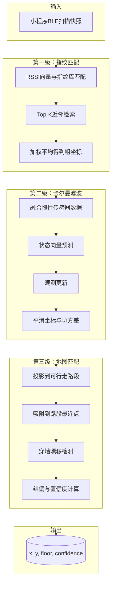

# PathAI 室内导航系统 · 定位融合算法

> **定位融合服务的三级流水线是精度保障的核心，分别处理粗定位、平滑和纠偏。**

## 一、算法架构总览

定位融合服务采用"指纹匹配 + 卡尔曼滤波 + 地图匹配"三级流水线架构：



## 二、第一级：指纹匹配

### 2.1 指纹采集

场馆建设阶段需进行一次指纹采集：工程师持采集工具沿可行走路段每 1~2 米停点一次，记录该点可见信标的 RSSI 向量，形成指纹库 $\mathcal{F} = \{(p_i, \mathbf{r}_i)\}$。

由于系统首期试点以视障用户为核心场景，定位精度要求从普通模式的中位误差 < 2 米提升到视障模式的中位误差 < 1 米（目标 ±0.9 米），因此视障模式下的指纹采集网格需要更细：

- 普通区域指纹采集间距为 2 米
- 安全节点区域（楼梯周边、电梯厅、交叉口、门口）采集间距加密至 1 米
- 每个指纹点采集时，工程师持手机站立静止 3 秒
- 为保证数据质量，每个点位在不同时段（上午、下午、晚间）各采一次，捕捉人流对 RSSI 的衰减影响

### 2.2 在线匹配算法

在线阶段，用户上报的 RSSI 向量 $\mathbf{r}$ 与库中每条指纹计算相似度，取 Top-K 近邻做加权平均得到粗坐标：

$$
\hat{p} = \frac{\sum_{i=1}^{K} s(\mathbf{r}, \mathbf{r}_i) \cdot p_i}{\sum_{i=1}^{K} s(\mathbf{r}, \mathbf{r}_i)}, \quad s(\mathbf{r}, \mathbf{r}_i) = \frac{1}{\|\mathbf{r} - \mathbf{r}_i\| + \epsilon}
$$

其中：
- $K = 5$（Top-5 近邻）
- $s(\mathbf{r}, \mathbf{r}_i)$ 是相似度函数，使用反距离加权
- $\epsilon$ 是防止除零的小常数

### 2.3 视障模式高精度配置

视障模式下缩小检索半径到当前路段周边 3 米范围内，提高局部精度：

- 缩短指纹检索半径：仅检索当前路段周边 3 米范围内的指纹点
- 提高采样频率：从 1 秒一次缩短到 500 毫秒一次
- 在楼梯、扶梯、电梯厅等高风险节点切换到更细的指纹网格

## 三、第二级：卡尔曼滤波

### 3.1 状态空间模型

卡尔曼滤波用于平滑指纹匹配的短时抖动，并融合手机惯性传感器数据。

**状态向量**：取位置与速度

$$
\mathbf{x} = [x, y, v_x, v_y]^T
$$

**观测向量**：取指纹粗坐标

$$
\mathbf{z} = [x_{fingerprint}, y_{fingerprint}]^T
$$

### 3.2 过程模型

过程模型用匀速假设，控制输入来自手机陀螺仪的航向角速度和加速度计的步进检测：

$$
\mathbf{x}_{k} = \mathbf{F} \cdot \mathbf{x}_{k-1} + \mathbf{B} \cdot \mathbf{u}_k + \mathbf{w}_k
$$

其中：
- $\mathbf{F}$ 是状态转移矩阵（匀速模型）
- $\mathbf{u}_k$ 是控制输入（加速度和航向角速度）
- $\mathbf{w}_k$ 是过程噪声

### 3.3 观测模型

$$
\mathbf{z}_k = \mathbf{H} \cdot \mathbf{x}_k + \mathbf{v}_k
$$

其中：
- $\mathbf{H}$ 是观测矩阵（从状态向量中提取位置分量）
- $\mathbf{v}_k$ 是观测噪声（指纹匹配的不确定性）

### 3.4 滤波更新

滤波器在每帧融合预测与观测，输出平滑坐标与协方差，协方差即置信度来源：

**预测阶段**：

$$
\begin{aligned}
\mathbf{x}_{k|k-1} &= \mathbf{F} \cdot \mathbf{x}_{k-1|k-1} + \mathbf{B} \cdot \mathbf{u}_k \\
\mathbf{P}_{k|k-1} &= \mathbf{F} \cdot \mathbf{P}_{k-1|k-1} \cdot \mathbf{F}^T + \mathbf{Q}
\end{aligned}
$$

**更新阶段**：

$$
\begin{aligned}
\mathbf{K}_k &= \mathbf{P}_{k|k-1} \cdot \mathbf{H}^T \cdot (\mathbf{H} \cdot \mathbf{P}_{k|k-1} \cdot \mathbf{H}^T + \mathbf{R})^{-1} \\
\mathbf{x}_{k|k} &= \mathbf{x}_{k|k-1} + \mathbf{K}_k \cdot (\mathbf{z}_k - \mathbf{H} \cdot \mathbf{x}_{k|k-1}) \\
\mathbf{P}_{k|k} &= (\mathbf{I} - \mathbf{K}_k \cdot \mathbf{H}) \cdot \mathbf{P}_{k|k-1}
\end{aligned}
$$

### 3.5 视障模式参数调整

视障模式下提高过程噪声中步进不确定性权重（视障用户步速波动更大）：

- 过程噪声 $\mathbf{Q}$ 增大：反映用户步速不稳定的特点
- 观测噪声 $\mathbf{R}$ 减小：因为视障模式下指纹匹配更精确
- 滤波输出的协方差迹的归一化值作为置信度

## 四、第三级：地图匹配

### 4.1 投影吸附

将滤波坐标投影到当前楼层的可行走路段集合，取投影距离最小的路段，把坐标吸附到该路段上最近点：

$$
p_{matched} = \arg\min_{p \in \text{walkable}} \|\hat{p} - p\|
$$

### 4.2 穿墙漂移检测

若投影距离超过阈值（1.5 米），判定为穿墙漂移：

- 回退到上一帧可信坐标
- 降低置信度
- 触发语音提示"定位信号较弱"

### 4.3 视障模式安全检测

视障模式额外增加安全节点检测：

若匹配路段连接到高风险节点（楼梯、扶梯），立即在该节点周边启用 0.5 米级精度的局部指纹子库重新匹配，确保安全提示的触发位置准确。

## 五、置信度输出策略

### 5.1 置信度计算

置信度由多个因素综合计算：

- 指纹匹配的相似度得分
- 卡尔曼滤波协方差的迹
- 地图匹配的投影距离

### 5.2 降级策略

当置信度低于 60% 时：

- 语音播报"定位信号较弱，请稍候"
- 暂停发出转弯指令，避免在不确定位置时误导用户
- 置信度恢复后再继续播报

### 5.3 视障模式降级增强

视障模式下降级策略更严格：

- 置信度阈值提高到 70%
- 降级时立即触发震动提醒
- 连续降级超过 3 次触发协助请求建议

## 六、算法性能指标

### 视障模式定位性能

| 指标 | 目标值 |
|------|--------|
| 定位误差中位数 | < 1 米 |
| 安全节点周边误差 | < 0.5 米 |
| 置信度降级触发率（信号良好区域） | < 5% |
| 冷启动定位时间 | < 3 秒 |

### 普通模式定位性能

| 指标 | 目标值 |
|------|--------|
| 定位误差中位数 | < 2 米 |
| 置信度降级触发率 | < 3% |
| 冷启动定位时间 | < 2 秒 |

## 七、算法伪代码示例

```python
class LocationFusionService:
    def __init__(self, fingerprint_db, topology_graph):
        self.fingerprint_db = fingerprint_db
        self.topology_graph = topology_graph
        self.kalman_filter = KalmanFilter()
        
    def locate(self, rssi_vector, imu_data, floor_hint=None, user_mode='blind'):
        """
        三级定位融合流水线
        
        Args:
            rssi_vector: 信标RSSI向量 [{beaconId, rssi}]
            imu_data: 惯性数据 {gyro, accel, ts}
            floor_hint: 楼层猜测
            user_mode: 用户模式 ('blind' / 'normal')
            
        Returns:
            (x, y, floor, confidence)
        """
        blind_mode = (user_mode == 'blind')
        # 降级阈值：视障模式 0.7，普通模式 0.6
        confidence_threshold = 0.7 if blind_mode else 0.6
        
        # 第一级：指纹匹配
        coarse_pos = self._fingerprint_match(rssi_vector, floor_hint, blind_mode)
        
        # 第二级：卡尔曼滤波
        smoothed_pos, covariance = self.kalman_filter.update(coarse_pos, imu_data)
        
        # 第三级：地图匹配
        matched_pos, is_valid = self._map_match(smoothed_pos, floor_hint)
        
        # 置信度计算
        confidence = self._calculate_confidence(
            coarse_pos, covariance, matched_pos, is_valid
        )
        
        # 降级处理
        if confidence < confidence_threshold:
            return self._degrade_response(matched_pos, confidence, blind_mode)
        
        return (matched_pos.x, matched_pos.y, floor_hint, confidence)
    
    def _fingerprint_match(self, rssi_vector, floor_hint, blind_mode=False):
        """指纹匹配算法"""
        # 视障模式缩小检索半径
        search_radius = 3.0 if blind_mode else 10.0
        
        # 从指纹库中检索
        fingerprints = self.fingerprint_db.query(
            floor=floor_hint,
            rssi_vector=rssi_vector,
            radius=search_radius
        )
        
        # Top-K近邻加权
        top_k = sorted(fingerprints, key=lambda fp: fp.similarity, reverse=True)[:5]
        
        # 反距离加权平均
        weights = [1.0 / (fp.distance + 1e-6) for fp in top_k]
        total_weight = sum(weights)
        
        x = sum(w * fp.x for w, fp in zip(weights, top_k)) / total_weight
        y = sum(w * fp.y for w, fp in zip(weights, top_k)) / total_weight
        
        return Point(x, y)
    
    def _map_match(self, position, floor):
        """地图匹配：投影吸附到可行走路段"""
        walkable_edges = self.topology_graph.get_walkable_edges(floor)
        
        min_distance = float('inf')
        best_point = None
        
        for edge in walkable_edges:
            # 计算点到线段的投影
            projected = self._project_to_segment(position, edge)
            distance = self._distance(position, projected)
            
            if distance < min_distance:
                min_distance = distance
                best_point = projected
        
        # 穿墙漂移检测
        is_valid = min_distance <= 1.5
        
        if not is_valid:
            # 回退到上一帧可信坐标
            return self.last_valid_position, False
        
        return best_point, True
```
