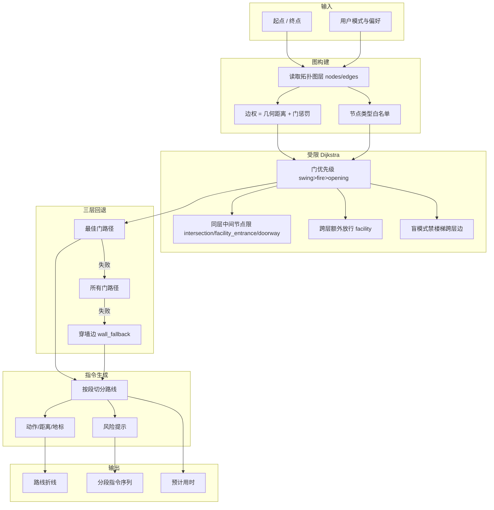

# PathAI 室内导航系统 · 路线规划算法

> **路线规划引擎的核心是 `src/topology/route_rules.py` 的**受限 Dijkstra**寻路：边权 = 几何距离 + 门惩罚，并施加中间节点类型约束、门优先级与盲模式禁楼梯跨层规则；无解时按"最佳门 → 所有门 → 穿墙边"三层回退。所有规则常量集中在 `src/common/constants.py`，前端经 `build_path_rules_js()` 注入，不内嵌于 JS。**

## 一、算法架构总览



## 二、受限图模型

### 2.1 图的构建

图的构建来自空间语义地图库的拓扑层（`floors["1"|"2"].topology`）。

- **节点**：对应地图拓扑节点，其 `type` 为全拼：`intersection`（交叉口）、`doorway`（门洞）、`room`（房间）、`facility`（设施）、`facility_entrance`（设施入口）。
- **边**：对应可通行路段；跨楼层连接体放在顶层 `crossFloorEdges`（`type` 为 `staircase` / `elevator`）。
- **门**：门是连接房间与公共空间、或两段公共空间的关键边，按其 `doorType`（`swing` / `fire` / `opening`）施加门惩罚。

### 2.2 边权与门惩罚

每条边的基础代价为几何距离，叠加门惩罚：

$$
W(e) = d(e) + P(\text{doorType}(e))
$$

其中门惩罚来自 `src/common/constants.py`：

| 门类型 | 常量 | 惩罚值 |
|--------|------|--------|
| 平开门 swing | `DOOR_PENALTY["swing"]` | 0.0 |
| 防火门 fire | `DOOR_PENALTY["fire"]` | 0.5 |
| 推开式 opening | `DOOR_PENALTY["opening"]` | 1.0 |
| 未知门类型（兜底） | `DOOR_DEFAULT_PENALTY` | 9.0 |

> 实测实现中**没有**"距离/转向/风险/拥挤度/能耗"5 个权重向量；多目标加权代价函数属于**未来扩展设想，尚未实现**。当前边权仅由"几何距离 + 门惩罚"两项构成。

### 2.3 中间节点类型约束

受限 Dijkstra 在扩展路径时对"中间节点"施加类型白名单（常量 `SAME_FLOOR_MID_TYPES` / `CROSS_FLOOR_MID_TYPES`）：

- **同层路径**：中间节点只允许 `{intersection, facility_entrance, doorway}`。
- **跨层路径**：在以上基础上额外放行 `facility`（即允许经由设施节点换乘）。
- 房间（`room`）必须经门（`doorway`）连入公共空间，**禁止穿墙**直连。

## 三、门优先级与路径规则

### 3.1 门优先级

当存在多条候选门时，按门类型排序，优先级为 **swing > fire > opening**（平开门最优，推开式最次）：

| 门类型 | 优先级 |
|--------|--------|
| swing（平开门） | 高 |
| fire（防火门） | 中 |
| opening（推开式） | 低 |

### 3.2 盲模式跨层规则

- 盲模式（`user_mode = 'blind'`）下，跨层**必须走电梯**，禁用楼梯跨层边（`crossFloorEdges` 中 `type = staircase` 的边不参与盲模式寻路）。
- 普通模式与轮椅模式可经电梯或楼梯跨层。

### 3.3 多权重代价函数（设想，尚未实现）

> 早期设计中的"5 个权重向量（距离/转向/风险/拥挤度/能耗）多目标 A*"属于**未来扩展设想，当前未实现**。`src/common/constants.py` 中**不存在**这组权重向量，当前实作为"几何距离 + 门惩罚"的受限 Dijkstra。

## 四、三层回退策略

`shortest_path` 在受限 Dijkstra 无解时，按以下顺序回退，直到得到一条可用路径（见 `src/topology/route_rules.py`）：

1. **最佳门路径**：仅使用优先级最高的门（`swing`）作为候选中间节点求解。
2. **所有门路径**：放宽门优先级约束，允许 `fire` / `opening` 门参与。
3. **穿墙边回退（wall_fallback）**：在前两层均失败（如拓扑缺口）时，允许少量穿墙边连接，保证至少返回一条几何上可达的路径，并标记 `wall_fallback=true` 供前端提示。

> 分层 A* 预处理（先楼层图粗规划再逐层精规划）为早期设想，**当前实现未采用**；跨层通过顶层 `crossFloorEdges` 直接建模为可通行边，由同一套受限 Dijkstra 一并处理。

## 五、受限 Dijkstra 寻路算法

### 5.1 代价函数

使用边权 $W(e) = d(e) + P(\text{doorType}(e))$（见 2.2）。标准 Dijkstra 在优先队列上扩展，但每扩展一个中间节点都校验节点类型白名单（见 2.3）与门约束。

### 5.2 约束校验

- 中间节点类型不在白名单内则剪枝；
- 盲模式下遇到楼梯跨层边直接跳过；
- 房间节点只能经由 `doorway` 进入，禁止与公共空间直接相连而穿墙。

### 5.3 算法伪代码

```python
def restricted_dijkstra(graph, start, goal, user_mode='blind', gate_filter=BEST_GATES):
    """受限 Dijkstra：几何距离 + 门惩罚，附节点类型与门约束"""
    import heapq
    from src.common.constants import DOOR_PENALTY, DOOR_DEFAULT_PENALTY

    dist = {start: 0.0}
    prev = {}
    pq = [(0.0, start)]
    while pq:
        d_u, u = heapq.heappop(pq)
        if u == goal:
            break
        if d_u > dist.get(u, float('inf')):
            continue
        for v, edge in graph.neighbors(u):
            # 节点类型白名单校验
            if not node_type_allowed(v, user_mode, cross_floor=is_cross(v)):
                continue
            # 盲模式禁止楼梯跨层
            if user_mode == 'blind' and edge.is_stair_cross:
                continue
            # 门优先级过滤
            if not gate_filter.allows(edge.door_type):
                continue
            w = edge.distance + DOOR_PENALTY.get(edge.door_type, DOOR_DEFAULT_PENALTY)
            nd = d_u + w
            if nd < dist.get(v, float('inf')):
                dist[v] = nd
                prev[v] = u
                heapq.heappush(pq, (nd, v))
    return reconstruct(prev, start, goal)  # 失败则触发三层回退


def shortest_path(graph, start, goal, user_mode):
    """三层回退：最佳门 → 所有门 → 穿墙边"""
    for gate_filter in (BEST_GATES, ALL_GATES, WALL_FALLBACK):
        path = restricted_dijkstra(graph, start, goal, user_mode, gate_filter)
        if path:
            return path
    return None
```

## 六、指令生成

### 6.1 指令切分

路线输出后由指令生成器按段切分。每段指令对应一个导航动作。

**切分规则**：

- 每个拓扑边对应一段指令
- 边的属性决定指令类型
- 安全节点（楼梯、电梯）单独成段

### 6.2 指令结构

每段指令包含动作、距离、地标、风险提示和视障附加描述，供语音无障碍服务消费：

```json
{
  "action": "turn_left",
  "distance": 12.0,
  "landmark": "蓝色立柱",
  "risk": null,
  "preempt": "前方将到达走廊交叉口",
  "priority": "normal",
  "floor": 1
}
```

### 6.3 指令类型

| 动作类型 | 说明 | 示例 |
|---------|------|------|
| `go_straight` | 直行 | "请向前直行 12 米" |
| `turn_left` | 左转 | "请向左转" |
| `turn_right` | 右转 | "请向右转" |
| `go_up` | 上楼 | "请乘电梯到 2 楼" |
| `go_down` | 下楼 | "请下楼到 1 楼" |
| `enter_elevator` | 进电梯 | "前方是电梯厅，请进入" |
| `exit_elevator` | 出电梯 | "电梯已到达，请出电梯" |
| `arrive` | 到达 | "您已到达目的地" |
| `warning` | 安全警告 | "前方 3 米有楼梯，请停下等待" |

### 6.4 视障模式指令增强

- 距离按视障用户平均步速（约 0.8 米/秒）换算为时间，同时保留米制距离
- 播报时两者都给出："前方约 12 米，步行约 15 秒"
- 安全节点段的 `priority` 设为 `"safety"`，触发后续优先级队列中的打断机制
- 每个指令增加地标描述，帮助视障用户建立空间认知

## 七、多目标路线对比

> **设想，尚未实现**：以下基于 5 权重向量的多目标路线生成/评分属于**未来扩展设想**，当前实作（`route_rules.py`）不生成多目标路线，仅输出受限 Dijkstra 单条最优路径。

### 7.1 路线生成

设想中系统可以同时生成多条不同偏好的路线：

- 最短路线：$w_d$ 权重最高
- 最少转弯路线：惩罚转弯节点
- 无障碍路线：$w_a$ 权重最高
- 避开拥挤路线：$w_c$ 权重最高
- 优先电梯路线：偏好电梯边
- 安静路线：避开人员密集区域

### 7.2 路线评分

对生成的多条路线进行评分，供用户选择：

```python
def score_route(route, user_preferences):
    """路线综合评分"""
    
    scores = {
        'distance': 1.0 / (route.total_distance + 1e-6),
        'time': 1.0 / (route.total_time + 1e-6),
        'accessibility': route.accessibility_score,
        'safety': 1.0 / (route.max_risk + 1),
        'turns': 1.0 / (route.total_turns + 1)
    }
    
    # 按用户偏好加权
    total = sum(
        weight * scores[key]
        for key, weight in user_preferences.items()
    )
    
    return total
```

## 八、算法性能指标

| 指标 | 目标值 | 说明 |
|------|--------|------|
| 单次规划耗时 | < 100 毫秒 | 单楼层室内路径 |
| 跨楼层规划耗时 | < 300 毫秒 | 含电梯换乘 |
| 重新规划耗时 | < 500 毫秒 | 导航中动态改道 |
| 规划路线正确率 | 100% | 避开禁用区域 |
| 指令切分合理性 | 每段 5~20 米 | 适合视障用户记忆 |

## 九、算法伪代码示例

```python
class RoutePlanningEngine:
    def __init__(self, semantic_map):
        self.semantic_map = semantic_map
        self.topo_graph = semantic_map.floors  # 多楼层字典

    def plan_route(self, start, goal, user_mode='blind', preferences=None):
        """
        路线规划主入口

        Args:
            start: 起点坐标 (x, y, floor)
            goal: 目的地标识或坐标
            user_mode: 用户模式 (blind/normal/wheelchair)
            preferences: 用户偏好字典（当前未参与代价计算）

        Returns:
            {
                'polyline': [...],        # 路线折线点
                'segments': [...],        # 分段指令序列
                'total_time': float,      # 预计用时（秒）
                'total_distance': float,  # 总距离（米）
                'wall_fallback': bool     # 是否触发穿墙回退
            }
        """
        # 1. 确定起终点拓扑节点（跨层目标经顶层 crossFloorEdges 处理）
        start_node = self._resolve_node(start)
        goal_node = self._resolve_goal(goal)

        # 2. 受限 Dijkstra + 三层回退（见 route_rules.py）
        path = shortest_path(self.topo_graph, start_node, goal_node, user_mode)

        # 3. 指令生成
        instructions = self._generate_instructions(path, user_mode)

        # 4. 统计
        total_distance = sum(e.distance for e in path.edges)
        total_time = total_distance / BLIND_WALK_SPEED if user_mode == 'blind' \
            else total_distance / NORMAL_WALK_SPEED

        return {
            'polyline': [n.coord for n in path.nodes],
            'segments': instructions,
            'total_time': total_time,
            'total_distance': total_distance,
            'wall_fallback': path.wall_fallback,
        }
```

> 注：上方代价仅由"几何距离 + 门惩罚"构成，步速 `BLIND_WALK_SPEED=0.8` / `NORMAL_WALK_SPEED=1.2`（来自 `constants.py`）用于估算 `total_time`；**不**使用 5 权重向量。`
