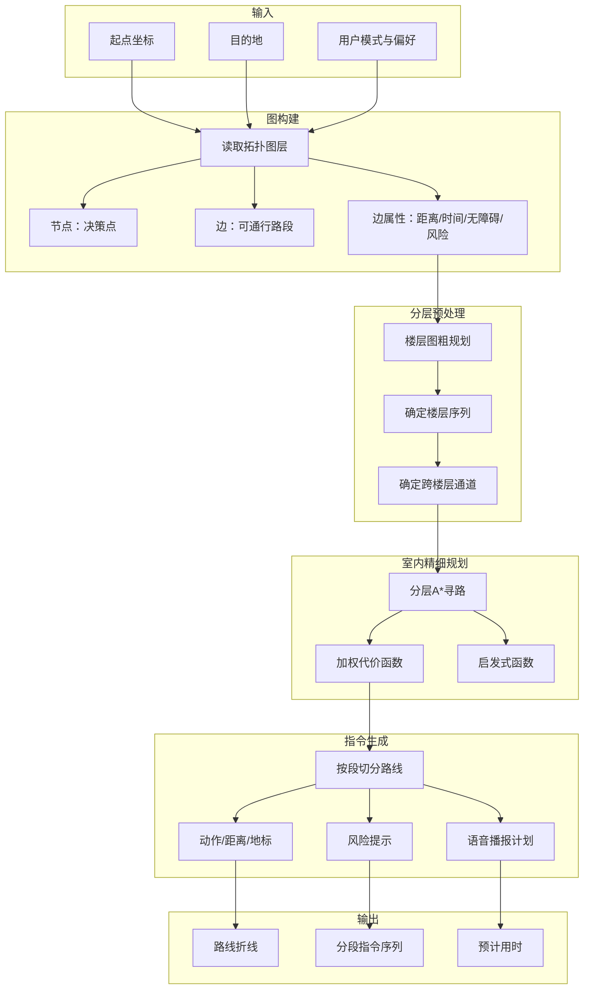

# PathAI 室内导航系统 · 路线规划算法

> **路线规划引擎的核心是加权有向图上的多目标 A* 寻路，配合分层预处理应对跨楼层场景。**

## 一、算法架构总览



## 二、加权有向图模型

### 2.1 图的构建

图的构建来自空间语义地图库的拓扑层。

- **节点**：对应地图拓扑决策点（转角、门口、电梯口、扶梯端、交叉口）
- **边**：对应可通行路段，附带距离、预估用时、无障碍等级、实时拥堵度和风险等级五个属性

### 2.2 边的属性

每条边从图纸和语义数据中自动推导出以下属性：

| 属性 | 符号 | 计算方式 |
|------|------|---------|
| 距离 | $d$ | 两个节点坐标的欧氏距离 |
| 预估用时 | $t$ | $t = d / v$，视障用户步速 $v$ 取 0.8 米/秒 |
| 无障碍等级 | $a$ | 0=平直, 2=有门槛/坡度, $\infty$=楼梯(禁用) |
| 风险等级 | $r$ | 0.5=普通, 3=中风险, 5=玻璃门, 10=楼梯口 |
| 拥堵度 | $c$ | 实时客流数据，0~1 区间 |

### 2.3 加权代价函数

边的代价由距离、时间、无障碍惩罚、拥堵成本和风险成本加权求和构成：

$$
W(e) = w_d \cdot d(e) + w_t \cdot t(e) + w_a \cdot a(e) + w_c \cdot c(e) + w_r \cdot r(e)
$$

不同用户模式对应不同权重向量 $[w_d, w_t, w_a, w_c, w_r]$。

## 三、视障模式权重配置

### 3.1 视障模式权重向量

视障模式大幅提高无障碍惩罚 $w_a$ 和风险成本 $w_r$，降低距离权重 $w_d$ 的相对重要性：

| 权重 | 视障模式 | 普通模式 | 说明 |
|------|---------|---------|------|
| $w_d$ | 1.0 | 3.0 | 距离权重 |
| $w_t$ | 0.5 | 2.0 | 时间权重 |
| $w_a$ | 10.0 | 1.0 | 无障碍惩罚（视障模式极高） |
| $w_c$ | 1.0 | 2.0 | 拥堵成本 |
| $w_r$ | 5.0 | 1.0 | 风险成本（视障模式极高） |

### 3.2 特殊边处理

**含楼梯的边**：$a$ 值设为最大惩罚值（999），相当于对视障用户禁用楼梯

**扶梯边**：$a$ 值设为中等惩罚（5），但附带"需工作人员协助"标签

**电梯边**：$a$ 值设为零惩罚，并标记为"推荐换乘"

**高风险边**：$r$ 值按风险等级递增，高风险边 $r=10$，中风险边 $r=3$，低风险边 $r=0.5$

这样 A* 会自然倾向于选择无障碍、少风险、少转弯的路线，即使距离更长。

## 四、分层预处理

### 4.1 分层原因

室内地图可能包含数千个节点，直接在整图上做 A* 会导致搜索空间膨胀。分层预处理把寻路分为两级，有效缩小搜索范围。

### 4.2 粗层：楼层图

节点为楼层，边为楼层间连接体（电梯、扶梯、楼梯）。先在此图上求出楼层序列。

**楼层图示例**：

```
[1层] --电梯--> [2层] --电梯--> [3层]
  |              |              |
  +--楼梯-->     +--楼梯-->     +--楼梯-->
```

### 4.3 细层：室内图

在每层室内图上，按楼层序列逐段执行 A*，拼接为完整路线。

**分层执行流程**：

1. 在楼层图上确定需要经过的楼层序列
2. 起点所在楼层：从起点到电梯口做 A*
3. 中间楼层：从电梯口到另一个电梯口做 A*（可能有多段）
4. 终点所在楼层：从电梯口到终点做 A*
5. 拼接所有段，形成完整路线

## 五、A* 寻路算法

### 5.1 代价函数

使用前述加权求和 $W(e)$ 作为实际代价。

### 5.2 启发式函数

启发函数用欧氏距离与楼层差加权：

$$
h(n) = \alpha \cdot d_{euclidean}(n, n_{goal}) + \beta \cdot |floor(n) - floor(n_{goal})|
$$

由于边代价是加权求和而非纯距离，直接使用裸欧氏距离会**高估**实际加权代价（当 $w_d$ 较小时），破坏 A* 的可采纳性（admissibility），导致返回非最优路线。处理方式是缩放启发系数：$\alpha$ 取不超过"每米最小有效加权代价"（即各权重配置下单位距离代价的下界，例如视障模式下 $w_d=1.0$，则 $\alpha \leq 1.0$），$\beta$ 同理取楼层高差对应的最小加权代价。更稳妥的做法是采用 ALT（A* + Landmarks + Triangle inequality）：预计算各节点到若干地标节点的加权最短距离，用三角不等式构造可采纳启发值，既保证最优性又显著加速搜索。

### 5.3 算法伪代码

```python
def a_star_search(graph, start, goal, weights):
    """加权A*寻路算法"""
    
    open_set = PriorityQueue()
    closed_set = set()
    
    g_score = {start: 0}
    f_score = {start: heuristic(start, goal)}
    came_from = {}
    
    open_set.add(start, f_score[start])
    
    while open_set:
        current = open_set.pop()
        
        if current == goal:
            return reconstruct_path(came_from, goal)
        
        closed_set.add(current)
        
        for neighbor in graph.get_neighbors(current):
            if neighbor in closed_set:
                continue
            
            edge = graph.get_edge(current, neighbor)
            
            # 计算边代价
            cost = (weights.w_d * edge.distance + 
                    weights.w_t * edge.time + 
                    weights.w_a * edge.accessibility + 
                    weights.w_c * edge.congestion + 
                    weights.w_r * edge.risk)
            
            tentative_g = g_score[current] + cost
            
            if tentative_g < g_score.get(neighbor, float('inf')):
                came_from[neighbor] = current
                g_score[neighbor] = tentative_g
                f_score[neighbor] = tentative_g + heuristic(neighbor, goal)
                open_set.add(neighbor, f_score[neighbor])
    
    return None  # 找不到路径
```

## 六、指令生成

### 6.1 指令切分

路线输出后由指令生成器按段切分。每段指令对应一个导航动作。

**切分规则**：

- 每个拓扑边对应一段指令
- 边的属性决定指令类型
- 安全节点（楼梯、扶梯、电梯）单独成段

### 6.2 指令结构

每段指令包含动作、距离、地标、风险提示和视障附加描述，供语音无障碍服务消费：

```json
{
  "action": "turn_left",
  "distance": 12.0,
  "landmark": "蓝色立柱",
  "risk": null,
  "preempt": "前方将到达走廊交叉口",
  "priority": "normal",
  "floor": 1
}
```

### 6.3 指令类型

| 动作类型 | 说明 | 示例 |
|---------|------|------|
| `go_straight` | 直行 | "请向前直行 12 米" |
| `turn_left` | 左转 | "请向左转" |
| `turn_right` | 右转 | "请向右转" |
| `go_up` | 上楼 | "请乘电梯到 2 楼" |
| `go_down` | 下楼 | "请下楼到 1 楼" |
| `enter_elevator` | 进电梯 | "前方是电梯厅，请进入" |
| `exit_elevator` | 出电梯 | "电梯已到达，请出电梯" |
| `arrive` | 到达 | "您已到达目的地" |
| `warning` | 安全警告 | "前方 3 米有楼梯，请停下等待" |

### 6.4 视障模式指令增强

- 距离按视障用户平均步速（约 0.8 米/秒）换算为时间，同时保留米制距离
- 播报时两者都给出："前方约 12 米，步行约 15 秒"
- 安全节点段的 `priority` 设为 `"safety"`，触发后续优先级队列中的打断机制
- 每个指令增加地标描述，帮助视障用户建立空间认知

## 七、多目标路线对比

### 7.1 路线生成

系统可以同时生成多条不同偏好的路线：

- 最短路线：$w_d$ 权重最高
- 最少转弯路线：惩罚转弯节点
- 无障碍路线：$w_a$ 权重最高
- 避开拥挤路线：$w_c$ 权重最高
- 优先电梯路线：偏好电梯边
- 安静路线：避开人员密集区域

### 7.2 路线评分

对生成的多条路线进行评分，供用户选择：

```python
def score_route(route, user_preferences):
    """路线综合评分"""
    
    scores = {
        'distance': 1.0 / (route.total_distance + 1e-6),
        'time': 1.0 / (route.total_time + 1e-6),
        'accessibility': route.accessibility_score,
        'safety': 1.0 / (route.max_risk + 1),
        'turns': 1.0 / (route.total_turns + 1)
    }
    
    # 按用户偏好加权
    total = sum(
        weight * scores[key]
        for key, weight in user_preferences.items()
    )
    
    return total
```

## 八、算法性能指标

| 指标 | 目标值 | 说明 |
|------|--------|------|
| 单次规划耗时 | < 100 毫秒 | 单楼层室内路径 |
| 跨楼层规划耗时 | < 300 毫秒 | 含电梯换乘 |
| 重新规划耗时 | < 500 毫秒 | 导航中动态改道 |
| 规划路线正确率 | 100% | 避开禁用区域 |
| 指令切分合理性 | 每段 5~20 米 | 适合视障用户记忆 |

## 九、算法伪代码示例

```python
class RoutePlanningEngine:
    def __init__(self, semantic_map):
        self.semantic_map = semantic_map
        self.topo_graph = semantic_map.topology
        
    def plan_route(self, start, goal, user_mode='blind', preferences=None):
        """
        路线规划主入口
        
        Args:
            start: 起点坐标 (x, y, floor)
            goal: 目的地标识或坐标
            user_mode: 用户模式 (blind/normal/wheelchair)
            preferences: 用户偏好字典
            
        Returns:
            {
                'polyline': [...],      # 路线折线点
                'segments': [...],      # 分段指令序列
                'total_time': float,    # 预计用时（秒）
                'total_distance': float, # 总距离（米）
                'alternatives': [...]   # 备选路线
            }
        """
        # 1. 获取权重向量
        weights = self._get_weights(user_mode, preferences)
        
        # 2. 确定目的地节点
        goal_node = self._resolve_goal(goal)
        
        # 3. 分层预处理
        floor_sequence = self._floor_planning(start, goal_node, weights)
        
        # 4. 分层A*寻路
        route_segments = []
        current_pos = start
        
        for floor in floor_sequence:
            # 在当前楼层做A*
            floor_route = self._a_star_on_floor(
                current_pos, 
                floor.exit_point, 
                floor.number,
                weights
            )
            route_segments.extend(floor_route)
            current_pos = floor.exit_point
        
        # 5. 指令生成
        instructions = self._generate_instructions(route_segments, user_mode)
        
        # 6. 计算统计信息
        total_distance = sum(seg.distance for seg in route_segments)
        total_time = sum(seg.estimated_time for seg in route_segments)
        
        return {
            'polyline': [seg.points for seg in route_segments],
            'segments': instructions,
            'total_time': total_time,
            'total_distance': total_distance,
            'alternatives': self._generate_alternatives(start, goal, weights)
        }
    
    def _get_weights(self, user_mode, preferences):
        """获取用户模式对应的权重向量"""
        weight_configs = {
            'blind': {
                'w_d': 1.0, 'w_t': 0.5, 'w_a': 10.0, 
                'w_c': 1.0, 'w_r': 5.0
            },
            'normal': {
                'w_d': 3.0, 'w_t': 2.0, 'w_a': 1.0, 
                'w_c': 2.0, 'w_r': 1.0
            },
            'wheelchair': {
                'w_d': 2.0, 'w_t': 1.0, 'w_a': 8.0, 
                'w_c': 1.5, 'w_r': 3.0
            }
        }
        
        weights = weight_configs.get(user_mode, weight_configs['normal'])
        
        # 应用用户偏好覆盖
        if preferences:
            for key, value in preferences.items():
                if key in weights:
                    weights[key] *= value
        
        return weights
```
