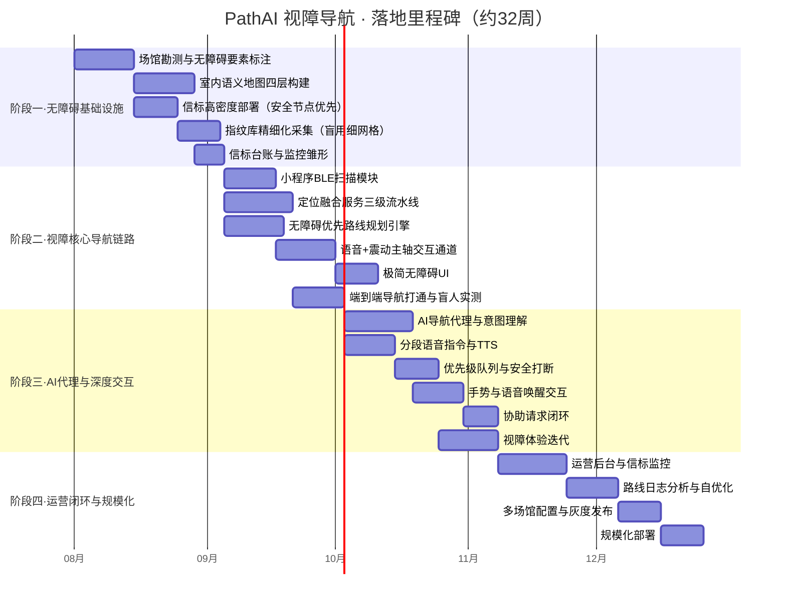

# PathAI 室内导航系统 · 实施路线图

> **首期试点以视障用户为核心用户群体（系统同时兼容普通访客、老年人及行动不便人士等用户模式），落地里程碑重构为四个阶段：无障碍基础设施、视障核心导航链路、AI代理与深度交互、运营闭环与规模化，每个阶段都以"视障用户能否独立完成一次安全导航"为验收锚点。**

## 一、整体里程碑



## 二、阶段一：无障碍基础设施与语义地图建设

**本阶段目标**：把试点场馆的物理空间转化为机器可读、AI 可理解的无障碍数字空间。所有后续能力的精度上限都由这一阶段决定，因此它是整个项目的基础锚点。

### 任务 1.1 场馆勘测与无障碍要素标注

**实现方案**：

- 组建勘测小组携带激光测距仪、卷尺、楼层平面图纸和移动采集设备
- 对试点场馆（首期试点为初中学部 1# 教学楼 1~2 层，图纸已获取）逐层步行采集
- 勘测重点不是绘制平面图，而是标注视障通行相关的无障碍要素

**每层需记录**：
- 墙体轮廓与房间分隔
- 门的位置与类型（平开门/推拉门/旋转门/玻璃门/自动门）
- 门宽是否满足轮椅通行
- 楼梯的精确位置及两端入口
- 电梯位置及无障碍电梯标识
- 坡道位置与坡度
- 盲道走向与断点
- 扶手位置
- 无障碍卫生间位置
- 地面材质变化点（如地砖转地毯）
- 玻璃幕墙等透明障碍物
- 施工围挡与临时障碍
- 照明盲区
- 紧急出口与消防通道

**风险等级划分**：
- 高风险：楼梯、玻璃门、旋转门、车辆出入口
- 中风险：自动门、闸机、湿滑地面、施工围挡
- 低风险：普通平开门、走廊转角

**交付物**：场馆无障碍要素标注表、各层勘测草图、风险节点清单、现场影像记录（无障碍要素与高风险节点逐一留照，见第七节 7.2）

**验收标准**：无障碍要素覆盖率 100%，高风险节点遗漏数为零，坐标误差小于 0.5 米

### 任务 1.2 室内语义地图四层构建

**实现方案**：基于勘测数据构建四层结构化地图，存入空间语义地图库。

**几何图层**：使用矢量格式存储墙体、房间轮廓、走廊中线、门窗洞口，坐标系采用场馆局部坐标系（以建筑主入口为原点），每层独立坐标系加楼层标识。

**语义图层**：为每个几何对象挂载属性标签：
- 房间用途（教室/阶梯教室/实验室/办公室/卫生间/电梯厅/楼梯间/大厅/设备间）
- 门类型
- 通道属性（人行/车行/无障碍专用）
- 是否常闭

**拓扑图层**：把可行走路段抽象为有向图节点与边，节点对应决策点（转角、门口、电梯口、交叉口），边对应可通行路段。

**无障碍图层**：专门标注坡道、盲道、电梯、扶手、障碍物和地面材质变化，每条边额外标注"轮椅可通行""视障友好""需协助"三个布尔标志。

**四层关联**：通过要素 ID 关联，形成完整空间对象的多维描述。

**交付物**：试点场馆四层语义地图、地图编辑器工具、地图版本管理规范

**验收标准**：拓扑图节点数覆盖所有决策点，无障碍图层与几何图层 100% 关联，跨楼层连接体（电梯/楼梯）在拓扑图中正确串联

### 任务 1.3 信标高密度部署（安全节点优先）

**实现方案**：信标部署遵循"决策节点优先"原则，而非均匀覆盖。普通走廊段按 **6 米**间距布置（见 `docs/07` §2.3），安全节点区域必须加密。

**高风险安全节点部署密度**：
- 楼梯两端入口各布一个信标，且在距入口 3~5 米处增设预警信标
- 电梯厅在电梯门口和厅入口各布一个
- 走廊交叉口四个方向各布一个
- 玻璃门与旋转门两侧各布一个
- 建筑出入口内外各布一个

**信标选型**：BLE 信标，iBeacon 广播格式（本项目落地选型为 RF-STAR RF-B-SR1 / Minew E5 系列，均支持 iBeacon）；电池 CR2477、厂商标称寿命 5 年；墙面 / 门套附着安装，安装高度统一 **2.2 m**（0 天花吊杆）。

**参数配置**（以现行台账 `result/ble_deployment.json` 实测为准）：
- 发射功率：全站统一 **−10 dBm**（统一功率是 RSSI→距离模型成立的前提，**禁止按区域分档**）
- 广播间隔：**300 ms**
- UUID/Major/Minor：统一 UUID `B9407F30-F5F8-466E-AFF9-25556B57FE6D`；major 按大区分段（1 / 2），minor 全局递增（实测 10001~20002）；**注意 major 不完全等于楼层**，判楼层须用 `floor` 字段（见 `docs/19`）

> ⚠️ 早期草案曾提「开阔走廊 −8 dBm / 密集区域 −12~−8 dBm」「广播 200 ms」「iBeacon + Eddystone 双帧、续航 3 年以上」，**均未采用**：分档功率会破坏统一 RSSI 模型的假设，使「同一 RSSI 对应不同距离」，与本项目全程 2.2 m 统一挂高、单 iBeacon 帧采集的实际做法冲突。现行口径详见 `docs/07` §2.3、`docs/19`。

**交付物**：信标部署点位图、信标台账库初始数据、信标物理安装验收报告、**信标逐枚安装影像（每枚 ≥3 张，编号可辨 + 环境全景 + 固定细节，见第七节 7.2）**

**验收标准**：安全节点信标覆盖率 100%，普通走廊盲区面积小于 5%，信标台账与物理点位一一对应

### 任务 1.4 指纹库精细化采集（盲用细网格）

**实现方案**：由于首期试点以视障用户为核心场景，视障模式定位精度目标为中位误差 < 1 米，因此指纹采集网格需要更细。

**采集规范**：
- 普通区域指纹采集间距为 2 米
- 安全节点区域（楼梯周边、电梯厅、交叉口、门口）采集间距加密至 1 米
- 每个指纹点采集时，工程师持手机站立静止 3 秒
- 为保证数据质量，每个点位在不同时段（上午、下午、晚间）各采一次

**交付物**：指纹库数据集、采集工具小程序（采集模式）、指纹覆盖率报告、测距读数影像（每个测点 ≥1 张，见第七节 7.2）

**验收标准**：安全节点区域指纹网格密度达到 1 米间距，普通区域达到 2 米间距，离线指纹匹配定位误差中位数小于 1.2 米

### 任务 1.5 信标台账与监控雏形

**实现方案**：搭建最简信标监控系统，在指纹采集过程中同步验证信标在线状态。

**功能**：
- 系统定期（每 5 分钟）扫描场馆内信标广播
- 与台账比对，发现离线信标立即告警
- 监控页面展示信标列表、在线状态、电池电量估算和最后心跳时间

**交付物**：信标在线监控看板（最简版）、离线告警通知（邮件/短信）

**验收标准**：信标在线检测延迟小于 10 分钟，离线告警通知到达率 100%

---

## 三、阶段二：视障核心导航链路打通

**本阶段目标**：跑通从信标扫描到语音播报的完整链路，让一位视障用户能够手持手机、戴上耳机，从建筑入口独立走到一个指定房间。本阶段不追求 AI 自然语言能力，先用结构化指令验证核心链路的可靠性与安全性。

### 任务 2.1 小程序 BLE 扫描模块开发

**实现方案**：开发微信小程序的 BLE 扫描模块，这是视障用户与信标网络之间的信号桥梁。

**初始化流程**：
1. 调用 `wx.openBluetoothAdapter` 初始化蓝牙适配器
2. 失败时语音提示"蓝牙未开启，请在设置中打开蓝牙"
3. 检查位置权限（Android 精确定位，iOS 始终授权）
4. 权限缺失时用语音引导用户到设置页

**扫描流程**：
1. 调用 `wx.startBluetoothDevicesDiscovery`，设置 `allowDuplicatesKey: true`
2. 注册 `wx.onBluetoothDeviceFound` 回调
3. 按信标 UUID 过滤，解析 iBeacon 帧
4. 采集结果在本地做时间窗口聚合：每 1 秒输出一个扫描快照

**后台保活**：
- 利用小程序"后台音频播放"保活机制
- 导航期间持续播放静音音频，保持后台活跃态
- `onHide` 时保存导航态到本地缓存
- `onShow` 时恢复并重建 WebSocket 连接

**交付物**：小程序 BLE 扫描模块、权限引导流程、后台保活方案

**验收标准**：前台扫描频率稳定 1 秒一次，后台保活下扫描中断小于 3 秒，信标解析正确率 100%

### 任务 2.2 定位融合服务三级流水线开发

**实现方案**：开发定位融合服务，实现指纹匹配 + 卡尔曼滤波 + 地图匹配三级流水线，专门为视障模式启用高精度参数。

**第一级指纹匹配**：
- 接收小程序上报的扫描快照
- 提取 RSSI 向量，在当前楼层指纹库中做 Top-K（K=5）最近邻检索
- 使用加权反距离公式得到粗坐标
- 视障模式缩小检索半径到当前路段周边 3 米范围内

**第二级卡尔曼滤波**：
- 状态向量 $\mathbf{x}=[x, y, v_x, v_y]^T$
- 观测值为指纹粗坐标
- 控制输入来自陀螺仪航向角速度和加速度计步进检测
- 视障模式提高过程噪声中步进不确定性权重
- 滤波输出平滑坐标与协方差矩阵

**第三级地图匹配**：
- 将滤波坐标投影到当前楼层可行走路段集合
- 吸附到最近路段上的最近点
- 若投影距离超过 1.5 米，判定穿墙漂移
- 视障模式增加安全节点检测：高风险节点周边启用 0.5 米级精度的局部指纹子库

**置信度降级**：
- 置信度低于 60% 时，语音播报"定位信号较弱，请稍候"
- 暂停发出转弯指令，避免在不确定位置时误导用户

**交付物**：定位融合服务、高精度模式参数配置、置信度降级策略

**验收标准**：视障模式定位误差中位数小于 1 米，安全节点周边误差小于 0.5 米，置信度降级触发率在信号良好区域低于 5%

### 任务 2.3 无障碍优先路线规划引擎开发

**实现方案**：路线规划引擎在拓扑图上执行**受限 Dijkstra**（节点类型约束 + 门惩罚）。早期设计中的「加权 A\* + 多目标权重向量」属**未来扩展设想，当前未实现**（`src/common/constants.py` 中不存在这组权重向量）。

**视障模式路由约束**：
- **边权** = 几何距离 + 门惩罚；`DOOR_PENALTY = {swing: 0.0, fire: 0.5, opening: 1.0}`（米），未知门类型兜底 `DOOR_DEFAULT_PENALTY = 9.0`
- **中间节点约束**：仅允许走廊/交叉口等流通节点，房间与卫生间不得中转（只能作起终点）
- **跨层**：本建筑无扶梯；楼梯跨层边在视障模式下禁用，跨层必须走电梯（`crossFloorEdges` 楼梯 7 + 电梯 3）
- **盲区**：视障模式剔除盲区节点，避免把用户导向不可通行区域；步速 `BLIND_WALK_SPEED = 0.8 m/s`

**指令生成**：路线规划完成后，指令生成器按段切分路线。

```json
{
  "action": "turn_left",
  "distance": 12.0,
  "landmark": "蓝色立柱",
  "risk": null,
  "preempt": "前方将到达走廊交叉口",
  "priority": "normal"
}
```

**交付物**：路线规划引擎、视障模式权重配置、指令生成器、指令模板库

**验收标准**：规划路线 100% 避开楼梯，电梯换乘优先级正确，指令段切分粒度合理（每段距离 5~20 米），安全节点段全部标记为高优先级

### 任务 2.4 语音 + 震动主轴交互通道开发

**实现方案**：这是视障导航的核心差异化模块。

**语音播报**：
- 常规指令：云端 TTS 实时合成，延迟控制在 500 毫秒以内
- 安全关键指令：预录音频包，触发时零延迟播放
- 预录音频覆盖约 30 条高频安全指令

**播报调度**：
- 低优先级：常规距离与方向提示，可被任意打断
- 中优先级：转弯指令与交叉口提示
- 高优先级：安全预警，立即打断并重复播报两次

**震动反馈编码**：
- 单次短震：即将转弯
- 连续三次短震：到达交叉口
- 单次长震（800ms）：需要停止
- 持续低频震动：偏离路线

**交付物**：TTS 合成服务接入、预录音频包、播报调度器与优先级队列、震动编码模块

**验收标准**：常规指令合成延迟小于 500 毫秒，安全指令预录音频触发延迟小于 100 毫秒，高优先级打断成功率 100%，震动与语音同步率 100%

### 任务 2.5 极简无障碍 UI 开发

**实现方案**：界面设计围绕"最少操作、最大触达"原则。

**首页布局**：纵向单列大按钮
- "说出目的地"：语音输入入口
- "常用地点"：上次导航地点快捷列表
- "我在哪里"：播报当前位置
- "呼叫协助"：长按触发

**导航中界面**：全屏单区域
- 顶部大字显示当前指令
- 中部显示距离
- 底部超大"重复指令"按钮
- 默认不显示地图

**交互手势**：
- 单指双击：重复指令
- 双指单击：暂停/继续播报
- 三指单击：请求协助
- 长按 2 秒：返回首页
- 左右滑动：切换上/下一条指令

**交付物**：极简无障碍 UI 组件库、手势识别模块、高对比度主题

**验收标准**：按钮可触达面积符合无障碍标准，TalkBack/VoiceOver 朗读覆盖率 100%，手势识别准确率大于 95%，单手操作完成全部核心功能

### 任务 2.6 端到端导航打通与盲人用户实测

**实现方案**：邀请 5~8 位视障用户（含全盲和低视力）在试点场馆进行实测导航。

**测试路线**：覆盖 4 类场景；**当前已固化 2 条基准路线**（见 `docs/08-信标部署与指纹采集实施方案` §1.1）：
- 路线 1（同层）：1F 音乐教室（F1-TR-0015）→ 组织办公（F1-TR-0036），140.4m
- 路线 2（跨层）：教师办公室（F1-TR-0033）→ 历史教室（F2-TR-0018），146.3m（经电梯）
- 待扩展场景：入口到教室、教室到卫生间、任意点到出口（按上述 4 类逐步补齐）

**记录指标**：
- 导航是否完成、完成用时
- 偏航次数与位置
- 重新规划是否成功
- 安全提示触发时机是否正确
- 用户主观安全感评分（1~5 分）
- 语音指令理解度评分
- 震动反馈感知度评分

**交付物**：实测报告、问题修复清单、视障用户体验基线数据

**验收标准**：导航完成率大于 85%，安全提示正确触发率 100%，用户安全感评分均值大于 3.5 分，定位误差未导致任何安全事件

---

## 四、阶段三：AI 代理与视障深度交互

**本阶段目标**：在已验证的核心链路上叠加 AI 自然语言能力和深度视障交互，让视障用户从"按预设路线走"升级为"对话式导航"。

### 任务 3.1 AI 导航代理与意图理解开发

**实现方案**：AI 导航代理是系统从"工具"升级为"助手"的关键。

**意图分类**：
- 导航请求："带我去 101 教室"
- 位置查询："我在哪里"
- 路线修改："改去最近的卫生间""避开人多的地方"
- 指令查询："下一步怎么走""还有多远"
- 协助请求："我需要帮助"

**混合架构**：
- 本地小模型：快速意图分类和槽位初提取（延迟 < 200ms）
- 云端大模型：模糊表达、多轮指代和复杂约束时介入补全

**交付物**：AI 导航代理服务、意图分类模型、槽位提取模块、会话状态机、混合推理架构

**验收标准**：意图分类准确率大于 90%，槽位提取 F1 值大于 0.85，多轮指代消解成功率大于 80%，本地分类延迟小于 200 毫秒

### 任务 3.2 分段语音指令与 TTS 深度优化

**实现方案**：引入 AI 生成的动态指令模板，让语音指令更自然。

**指令长度控制**：
- 常规指令：不超过 15 字（约 5 秒播报）
- 转弯指令：不超过 20 字
- 安全预警：不超过 10 字且重复两遍

**TTS 语音选型**：
- 默认语速比正常语速慢 10%
- 用户可在设置中调整语速
- 关键安全指令使用稍快语速和更高音调
- 预录音频包扩展到 80 条

**交付物**：AI 动态指令生成模块、指令长度与语速控制策略、扩展预录音频包、TTS 语速配置

**验收标准**：指令播报在决策点前完成率大于 95%，安全指令重复播报率 100%，用户指令理解度评分较阶段二提升 0.5 分以上

### 任务 3.3 优先级队列与安全打断机制完善

**实现方案**：增加预测性安全预判，从"到达时提醒"升级为"提前预判"。

**预测性预警**：
- 根据用户当前坐标、行进方向和步速，预测未来 5 秒内将接近的安全节点
- 实际在距安全节点 6 米时开始准备播报

**抢占式播报**：
- 高优先级安全指令进入队列时，插入短促提示音
- 引起用户注意后再播报安全内容

**危险静止策略**：
- 用户行进方向正对高风险区域且距离 < 2 米时
- 触发连续长震动并播报"请停下，前方危险"

**交付物**：预测性安全预判模块、抢占式播报机制、危险静止策略

**验收标准**：安全预警提前触发率大于 90%，抢占式播报用户感知确认率大于 95%，危险静止策略在实测中零漏报

### 任务 3.4 手势与语音唤醒交互完善

**实现方案**：增加语音唤醒和免触交互，让视障用户全程无需看屏幕。

**语音唤醒**：
- 唤醒词："小路小路"
- 本地运行轻量级关键词识别模型
- 仅在前台导航态生效
- 后台态通过手势或耳机按键触发

**耳机交互**：
- 单击：播放/暂停
- 双击：下一指令
- 长按：请求协助

**环境描述升级**：
- "我在哪里"升级为环境描述
- 结合空间语义地图生成完整环境描述

**交付物**：语音唤醒词检测模块、耳机按键适配、环境描述生成功能

**验收标准**：唤醒词识别准确率大于 92%，环境描述准确率大于 90%，耳机按键响应率 100%

### 任务 3.5 协助请求闭环开发

**实现方案**：完成从用户到服务台的完整闭环。

**闭环流程**：
1. 用户长按或三指点击触发协助请求
2. 小程序通过 WebSocket 发送协助工单
3. 工单包含匿名会话 ID、当前定位坐标、楼层和路线目的地
4. 服务台确认接收后，播报"协助请求已发出，工作人员正在赶来"
5. 超时机制：60 秒未确认则升级通知值班主管
6. 用户可随时取消请求

**交付物**：协助工单服务、服务台最简看板、超时升级机制、实时位置更新

**验收标准**：协助请求送达延迟小于 3 秒，服务台确认率 100%，超时升级触发正确，用户取消同步到服务台

### 任务 3.6 视障体验迭代

**实现方案**：组织第二轮视障用户实测。

**测试规模**：10~15 位用户，每人 60 分钟

**覆盖场景**：
- 多楼层换乘
- 中途改目的地
- 路线被施工封闭需绕行
- 协助请求全流程

**交付物**：第二轮实测报告、体验迭代版本、P0/P1 问题修复清单

**验收标准**：导航完成率大于 90%，安全提示正确触发率 100%，用户安全感评分均值大于 4 分，协助请求平均响应时长小于 5 分钟

---

## 五、阶段四：运营闭环与规模化

**本阶段目标**：建立可持续运营的能力，让系统从"试点可用"走向"长期可靠、可复制到多场馆"。

### 任务 4.1 运营后台与信标监控开发

**实现方案**：开发完整的场馆运营后台 Web 端。

**功能模块**：
- 地图管理：版本化编辑与灰度发布
- 信标监控：在线状态、电池电量、信号强度趋势
- 施工配置：划定施工封闭区域
- 协助工单处理：接收和处理协助请求
- 用户反馈分析：查看用户反馈和评分

**交付物**：运营后台 Web 端、地图版本管理与灰度发布、信标监控看板、施工区域配置工具

**验收标准**：地图灰度发布回滚可用，信标离线告警延迟小于 5 分钟，施工封闭区域路线绕行生效时间小于 1 分钟

### 任务 4.2 路线日志分析与自优化开发

**实现方案**：开发分析能力，形成数据驱动的自优化闭环。

**分析维度**：
- 迷路热点地图：哪些节点偏航率最高
- 指令有效性分析：哪些指令段后偏航率高
- 安全提示准确率：哪些安全节点存在漏报或误报
- 路线用时分析：实际用时与预估偏差

**自优化机制**：
- 偏航率高于阈值的节点自动标记为"需优化"
- AI 代理自动调整指令模板
- 步速参数根据实际用时数据每周自动校准

**交付物**：路线日志分析看板、迷路热点地图、自优化规则引擎、步速自动校准

**验收标准**：迷路热点识别覆盖率大于 95%，自优化规则触发后偏航率下降可度量，步速校准误差小于 10%

### 任务 4.3 多场馆配置与灰度发布

**实现方案**：系统从单场馆扩展到多场馆。

**数据隔离**：
- 每个场馆拥有独立的空间语义地图、指纹库、信标台账
- 通过 `venueId` 隔离
- 信标 UUID 的前 8 位编码场馆 ID

**灰度发布**：
- 按场馆灰度：新地图版本先在一个场馆验证
- 按用户比例灰度：新功能先开放给 10% 用户

**交付物**：多场馆数据隔离方案、场馆自动识别、灰度发布框架

**验收标准**：场馆切换自动识别准确率 100%，多场馆数据隔离无串扰，灰度发布可按比例和按场馆控制

### 任务 4.4 规模化部署

**实现方案**：完成第二批场馆的部署，验证多场馆复制效率。

**标准化手册**：
- 场馆勘测 SOP
- 信标部署 SOP
- 指纹采集 SOP
- 验收测试 SOP

**运营 SLA**：
- 信标在线率 > 98%
- 定位服务可用率 > 99.5%
- 协助请求响应时长 < 5 分钟
- 安全提示零漏报

**交付物**：多场馆部署实例、标准化部署手册、SLA 监控看板

**验收标准**：新场馆上线周期 < 4 周，信标在线率 > 98%，定位服务可用率 > 99.5%

---

## 六、阶段验收总览

| 阶段 | 周期 | 核心交付 | 阶段验收锚点 |
|------|------|---------|------------|
| 一·无障碍基础设施 | 第1~8周 | 语义地图、信标网络、指纹库 | 定位误差中位数 <1.2m，安全节点零遗漏 |
| 二·核心导航链路 | 第9~18周 | BLE扫描、定位服务、规划引擎、语音震动通道 | 视障用户导航完成率 >85%，安全提示 100% 正确 |
| 三·AI代理与深度交互 | 第17~26周 | AI代理、动态指令、预测性安全、手势语音唤醒 | 导航完成率 >90%，安全感评分 >4 分 |
| 四·运营闭环与规模化 | 第25~32周 | 运营后台、自优化、多场馆、部署手册 | 新场馆上线 <4 周，SLA 达标 |

> 上表各阶段验收均需附**现场影像证据**；哪些环节必拍、怎么拍、怎么归档，见第七节。

## 七、施工作业影像记录建议（拍照留用）

**为什么必须拍**：本项目的核心资产是"空间真值"——信标装在哪、测距读数是多少、现场当时长什么样。这些信息一旦施工结束就无法回溯：护墙板更换、家具挪位、临时围挡撤除、灯具改造，都会让"当初为什么这么定"变成无法回答的问题。影像记录是唯一能把**施工瞬间的现场**固化下来的手段，也是验收取证、数据复盘、故障排查与多场馆复制的共同依据。

### 7.1 三条记录原则

1. **可复现**——每张照片都要能回答"这是哪一层、哪个点位、拍的是什么"。画面内必须有可识别的固定参照物（柱、门框、楼层标识）或拍摄板，光靠文件名不算。
2. **可对账**——照片编号与 `ble_deployment.json` 台账、指纹采集表一一对应，不能靠"看着像"来判断对应关系。
3. **可合规**——试点校区为未成年人密集场所，拍摄须先取得校方授权，避开学生、不留清晰人脸（详见 7.5）。

### 7.2 必拍环节清单（按优先级）

| 优先级 | 环节 | 对应任务 | 拍摄对象 | 张数要求 | 留用用途 |
|--------|------|---------|----------|----------|----------|
| **P0** | 信标逐枚安装 | 1.3 | ① 安装完成正面（编号标签清晰可辨）② 安装环境全景（含相邻门/走廊标识）③ 固定细节（载体与固定方式） | 每枚 **≥3 张**（61 枚约 183 张） | **台账与物理点位一一对应的唯一证据**；后续换电池、故障定位、点位微调的依据 |
| **P0** | 建库测距读数 | 1.4 | 测距仪 / 卷尺读数 + 锚点方向同框 | 每测点 **≥1 张** | 指纹库坐标真值的原始凭证；数据争议时的复核依据 |
| **P0** | 图纸—实建差异 | 1.1 | 现场与 CAD 图纸不符处（近景 + 手绘草图标注页同框） | 每处 **≥2 张**（近景 + 环境） | 回写 `surveyRequired` 字段的判定依据；避免后续被质疑"数据与现场不符" |
| **P1** | 无障碍要素与高风险节点 | 1.1 | 坡道、盲道、扶手、无障碍卫生间、地面材质变化点；楼梯口、玻璃门、旋转门、车辆出入口 | 每要素 **≥2 张**（近景 + 关系全景） | 无障碍图层与风险等级的现场依据；隐患同步反馈校方 |
| **P1** | 指纹采集点环境 | 1.4 | 采集点三维环境（墙面材质、遮挡物、邻近信标） | 抽采 **≥20%**，安全节点 **100%** | 解释 RSSI 空间特征；判断"数据异常是环境变了还是设备坏了" |
| **P1** | 覆盖验收过程 | 1.3 验收 | 手机扫描界面与测量工具 / 读数同框 | 每验收批次 **≥3 张** | 验收证据链 |
| **P2** | 既有安全隐患 | 贯穿 | 破损地面、缺失扶手、玻璃门无警示条、照明盲区 | 每处 **≥1 张** | 作为项目对校方的安全建议附件（正向回馈） |
| **P2** | 环境变更留档 | 贯穿 | 施工围挡、临时障碍、家具/展板位置变化 | 变更前后各 **≥1 张** | 判断信标可见性与指纹库是否需重建 |
| **P2** | 用户实测过程 | 2.6 / 3.6 | 实测路线与关键节点 | 按校方许可；**录像需单独审批** | 实测报告佐证与汇报素材（人像处理见 7.5） |

> **口径说明**：P0 三类是"工程不可逆信息"，必须 100% 覆盖、不允许抽采；P1 允许抽采但安全节点必须全覆盖；P2 按现场实际情况记录，不作为验收硬指标。

### 7.3 单张照片怎么拍（规范）

- **高度与角度**：信标照在信标等高位置平视拍摄（约 2.2 m），避免大仰角造成编号变形；安装环境全景退到 3~5 m 外拍摄，视角覆盖信标与最近的门/走廊标识。
- **必须有不变参照物**：柱、门框、楼层标识、消火栓箱等固定物可作参照；家具、展板、绿植会移动，**不能作为唯一参照**。
- **编号必须可读**：信标编号文字是照片的核心信息，光线不足时补光，避免运动模糊；拍完当场回看确认可辨。
- **拍摄板**：用采购清单中 D1 的编号标签纸 + 一张 A5 白纸手写「楼层-点位编号-日期」，每张照片入镜，使照片自带身份信息（成本 ¥0，免去事后回忆）。
- **比例尺**：采购清单中的卷尺（A5）与激光测距仪（A1）既是测量工具也是照片中的比例尺与读数凭证，读数与仪器同框拍下。
- **关闭相机地理标记**：场馆物理坐标属场馆资产（见第八节「信标安全」），影像不得携带相机自动位置水印。

### 7.4 命名与归档

**命名模板**：`{楼层}-{类别码}-{对象ID}-{序号}-{日期}.jpg`

| 类别码 | 含义 | 类别码 | 含义 |
|--------|------|--------|------|
| `BC` | 信标安装 | `SV` | 图纸勘测与差异 |
| `FP` | 指纹采集点 | `AC` | 无障碍要素 |
| `HZ` | 隐患 | `EV` | 环境变更 |

示例：

```
F1-BC-BK-01-001-01-20261012.jpg   # 信标安装正面
F1-BC-BK-01-001-02-20261012.jpg   # 安装环境全景
F1-BC-BK-01-001-03-20261012.jpg   # 固定细节
F1-FP-0611-01-20261013.jpg        # 采集点测距读数
F1-SV-002-01-20261011.jpg         # 图纸—实建差异
```

**对象 ID 取值规则**：信标直接用台账 `beaconId`（保证与 `ble_deployment.json` 可对账）；指纹采集点用该层采集点序号；图纸差异、隐患、环境变更用当次发现的顺序号。

**相册侧目录**（原始影像，存共享盘）：

```
site-visual-records/
├── F1/
│   ├── 01-survey/       勘测与差异
│   ├── 02-beacon/       信标安装
│   ├── 03-fingerprint/  指纹采集点
│   ├── 04-hazard/       隐患
│   └── 05-change/       环境变更
└── F2/  （同构）
```

**仓库侧只存索引表**：`docs/site-visual-index.csv`（**待创建**：当前仓库尚无该文件，首次现场施工后按此表头新建），字段为
`photo_file, floor, category, object_id, seq, shot_at, photographer, note`。

> ⚠️ **影像文件不入 git 仓库**。原因有二：① 照片体积远超代码库合理范围（与项目既有的"大体积二进制不入库"约定一致，参考 11M 信标 SDK zip 的处置）；② 影像含场馆环境信息，需按授权范围管理。**仓库内只提交索引表**，原始影像放校方/实验室共享盘或对象存储。

### 7.5 合规与隐私（校区为未成年人密集场所）

- **先授权后拍摄**：进场拍摄前取得校方书面许可，明确可拍摄区域、时段与用途范围。
- **避开学生**：优先安排在非课间时段或放学后；如画面不可避免拍到学生，**现场立即回看并删除含清晰人脸的底片**，不得延后处理。
- **禁止外传**：含师生人像的照片不得上传公有云、不得用于项目外用途；确需用于汇报时，先做人脸遮挡并单独报批。
- **与地图数据同级管理**：教室门牌、房间编号、楼层标识等照片，与空间语义地图数据同等授权管理，不向无关方提供。
- **录像从严**：用户实测（任务 2.6 / 3.6）如需录像，须单独取得书面知情同意，并在画面中避免人脸与可识别的个人信息。

### 7.6 与验收标准的挂接

| 验收标准（出处） | 影像证据 |
|------------------|----------|
| 信标台账与物理点位一一对应（任务 1.3） | 每枚 ≥3 张安装照 + `site-visual-index.csv` 索引 |
| 高风险节点遗漏数为零（任务 1.1） | 高风险节点照片清单逐条核对 |
| 指纹网格密度达标（任务 1.4） | 抽点复核以测距读数照片为准 |
| 无障碍要素覆盖率 100%（任务 1.1） | 无障碍要素照片清单与标注表互校 |

> **台账字段建议**：在 `ble_deployment.json` 中为每枚信标**增设 `photoRef` 字段**（指向对应影像的文件名或索引 ID），使「数据—实物—影像」三者可互相追溯。（该字段为建议新增，尚未落地。）

### 7.7 所需准备（不新增采购）

- **拍摄设备**：复用成员现有手机，不新增采购；相机关闭地理标记即可。
- **拍摄板**：采购清单 D1 的编号标签纸 + A5 白纸手写内容，成本 ¥0。
- **比例尺与读数凭证**：采购清单中的卷尺（A5）、激光测距仪（A1）一物两用，无需新增。
- **归档**：索引表随仓库提交，原始影像进共享盘；建议以「当次施工作业」为单位建档，并在信标台账/指纹采集记录中回填索引 ID。

## 八、安全与隐私设计

### 数据脱敏

- 上报的坐标与轨迹仅关联匿名会话 ID，不绑定真实身份
- 用户画像以偏好向量存储，不含可识别信息
- 路线日志在保留期内用于模型优化，到期自动匿名化或删除

### 医院场景特殊处理

- 预约信息、科室去向等敏感数据仅在本地化部署的代理中处理
- 采取"本地小模型做意图分类 + 必要时调用受控云端模型"的混合架构
- 敏感字段不出院区

### 协助请求最小化

- 一键协助只发送匿名定位与会话 ID 给服务台
- 不附加姓名或病历
- 服务台确认后由用户决定是否进一步提供身份信息

### 信标安全

- 信标广播帧不含敏感信息
- 信标台账的物理坐标属场馆资产
- 仅授权运营人员可查，不向终端暴露原始坐标

## 九、核心设计决策

这套落地方案的核心思路是：

> **视障用户从第一天就是核心用户，所有设计决策都以"视障用户能否独立安全通行"为最高评判标准（系统同时保留普通、轮椅等用户模式）。语音与震动是主轴而非附属，安全节点是信标部署和定位精度的最高优先级，AI 能力在可靠的核心链路验证后才叠加，避免在不稳固的地基上堆砌智能功能。**

先扎实做好地图与信标基础设施，再叠加 AI 与无障碍能力，系统能够稳步从试点走向规模化。
